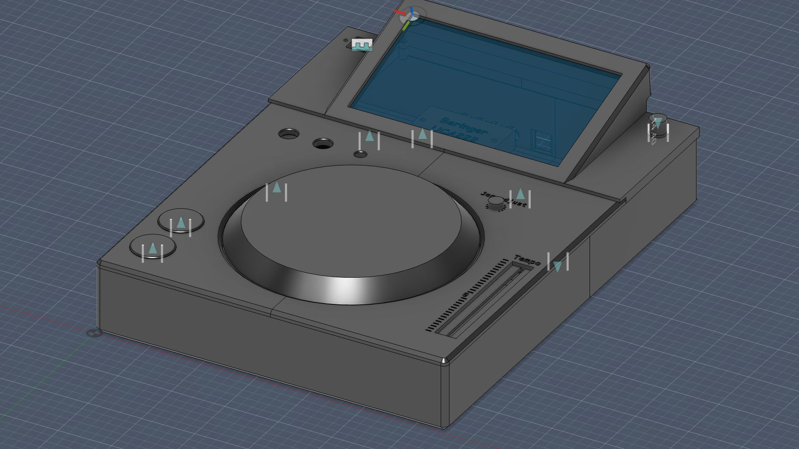
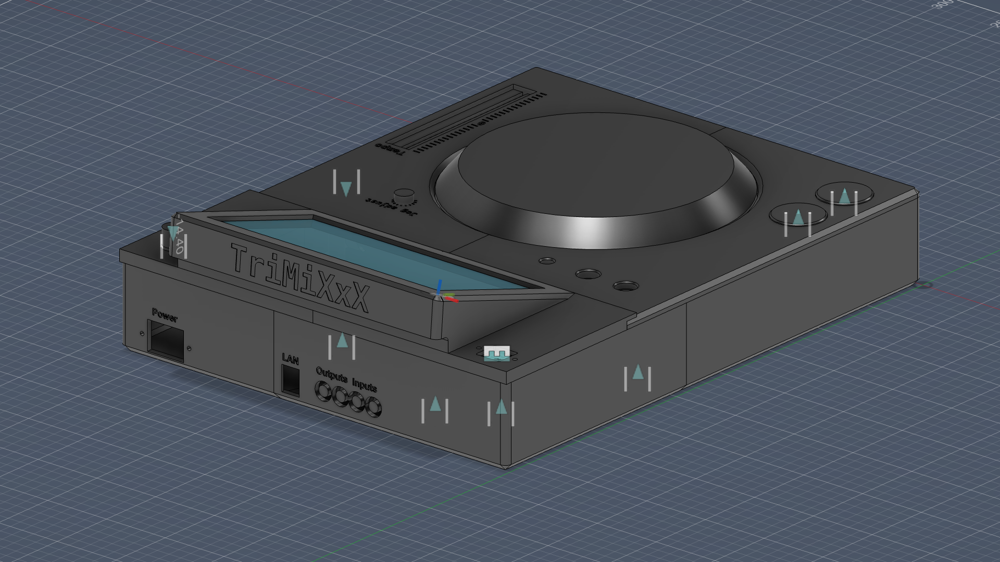
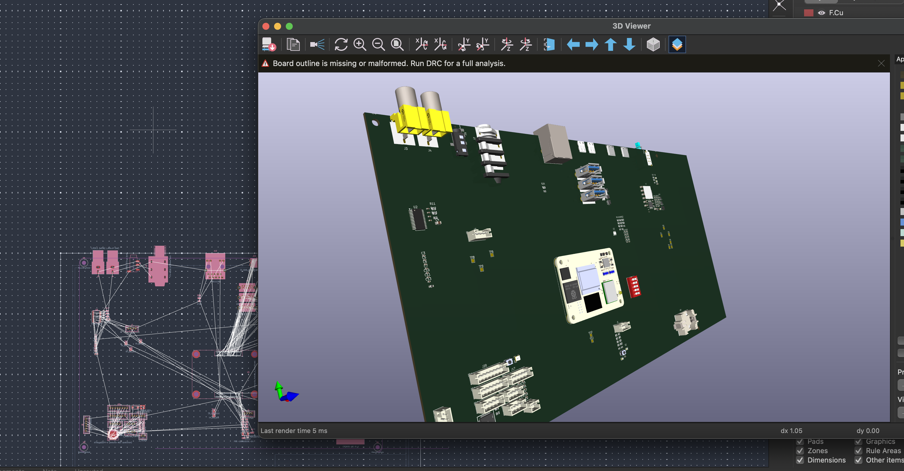
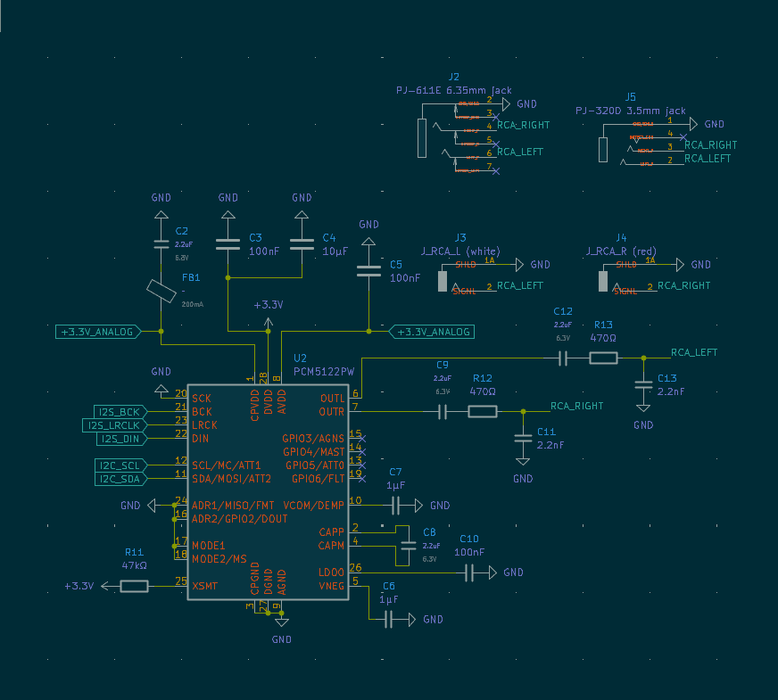
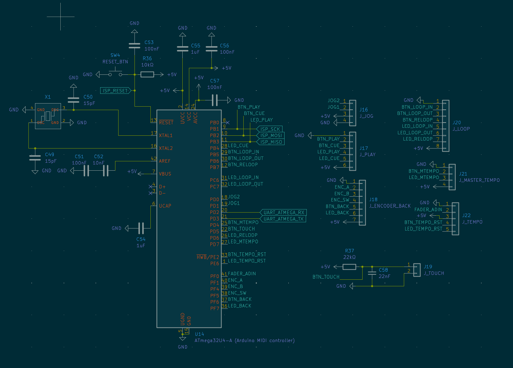
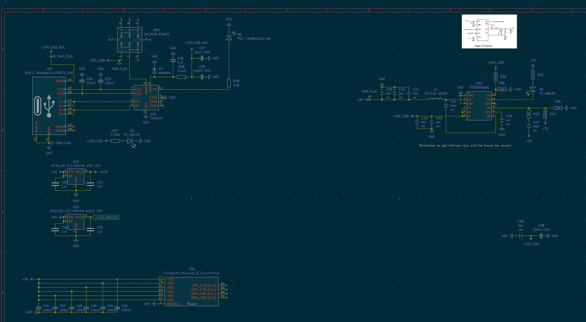
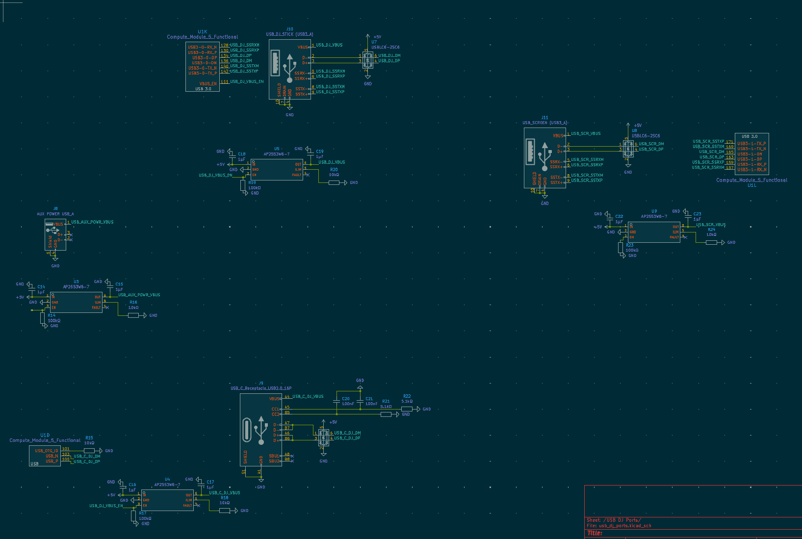
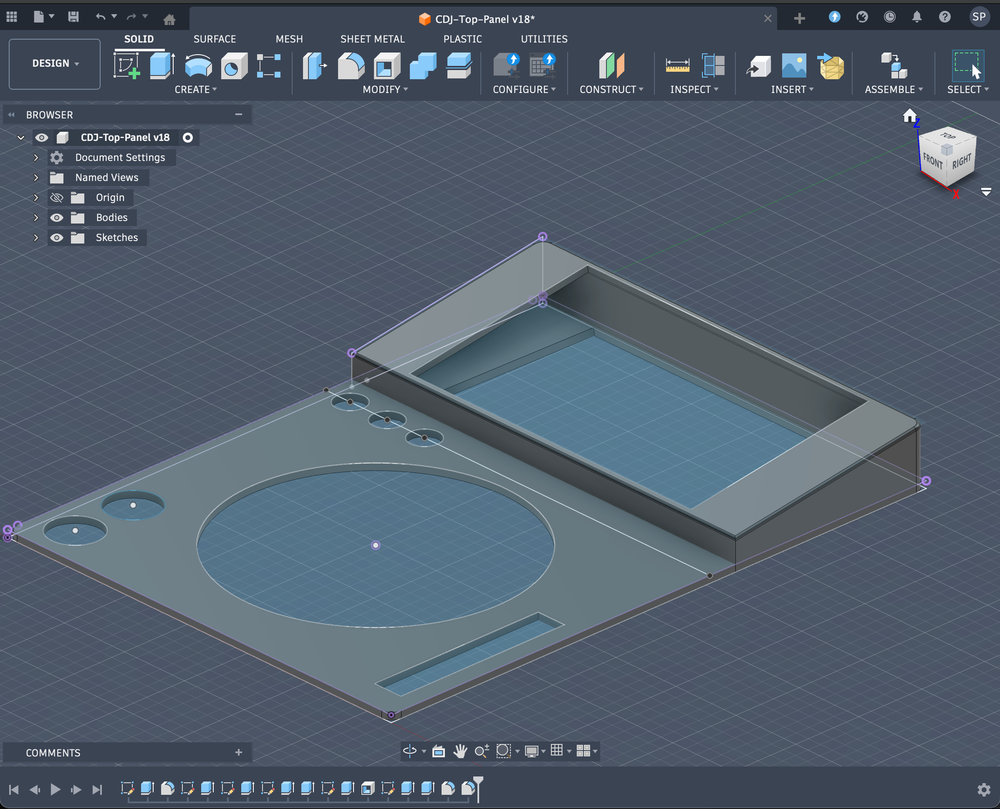
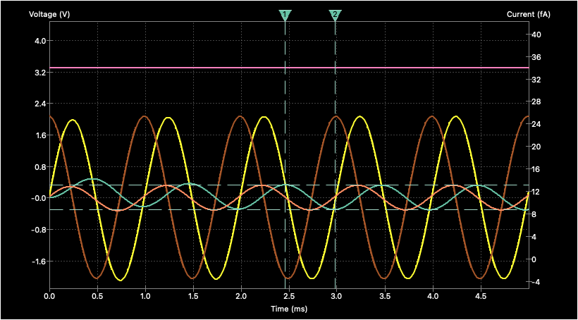
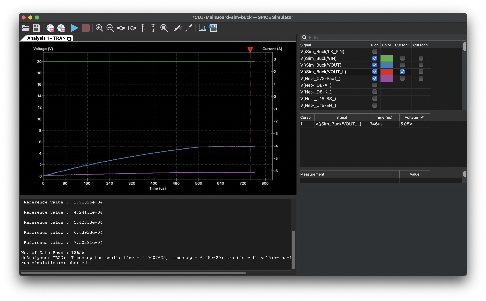

# TriMixxx

A custom CDJ (Compact Disc Jockey) unit built from scratch around a Raspberry Pi CM5, designed to run [Mixxx](https://mixxx.org/) DJ software. Features a custom PCB, a custom 3D-printed chassis, and reuses original CDJ buttons and jog wheel for an authentic DJ experience. Reads Rekordbox-formatted USB sticks — no laptop required.







## What is this?

TriMixxx replaces the internals of a CDJ with modern, open-source-friendly hardware while keeping the physical controls that DJs know and love. Plug in a Rekordbox-formatted USB stick, and you're ready to mix.

## Hardware Architecture

### Compute

- **Raspberry Pi CM5** — runs Mixxx and handles audio playback, connected via dual DF40 100-pin high-density connectors

### Audio

- **TI PCM5242** — high-quality stereo DAC connected over I2S for low-latency audio output
- **RCA stereo pair** — Left (white) and Right (red) main outputs
- **6.35mm (1/4") headphone jack**
- **3.5mm headphone jack**

### MIDI Controller

- **ATmega32U4** — acts as a USB MIDI class-compliant device, reading the original CDJ's buttons, encoders, fader, and jog wheel and translating them into MIDI messages for Mixxx
- **16 MHz crystal** oscillator for reliable USB timing

All controls connect via JST PH connectors to the main PCB:

| Connector | Controls |
|---|---|
| **J_PLAY** (6-pin) | Play button + LED, Cue button + LED |
| **J_LOOP** (8-pin) | Loop In button + LED, Loop Out button + LED, Reloop button + LED |
| **J_MASTER_TEMPO** (4-pin) | Master Tempo button + LED |
| **J_ENCODER_BACK** (7-pin) | Back/browse rotary encoder + Back button + LED |
| **J_TEMPO** (5-pin) | Tempo fader (analog ADC input) + Tempo Reset button + LED |
| **J_JOG** (4-pin) | Jog wheel quadrature encoder (JOG1/JOG2) |
| **J_TOUCH** (2-pin) | Jog wheel capacitive touch sensor |

**Summary of buttons:** Play, Cue, Loop In, Loop Out, Reloop, Master Tempo, Tempo Reset, Back — each with a corresponding LED. Plus a tempo fader (analog), a browse/back rotary encoder, a jog wheel (quadrature encoder), and a jog wheel touch sensor.

### Power

- **USB-C power input** with **CH224K** USB PD negotiation (requests 20V @ 3A = 60W, peak draw 42.4W)
- **SY8368AQQC** synchronous buck converter stepping 20V down to 5V for the CM5 and peripherals
- **AP2112K** 3.3V LDO for logic-level components
- **AP2553W** USB power switches for safe hot-plug on DJ USB ports

### Connectivity

| Port | Type | Speed | Purpose |
|---|---|---|---|
| **USB-A** | Full-size | USB 3.0 SuperSpeed | Rekordbox USB sticks |
| **USB-A** | Full-size | Power only (no data) | Auxiliary power for gadgets/lights |
| **USB-C** | Receptacle | USB 2.0 | General connectivity |
| **Micro HDMI** | Type D | HDMI 1.4 | 10" touchscreen display |
| **Micro HDMI** | Type D | HDMI 1.4 | Debug/secondary screen |
| **Ethernet** | RJ45 (via CM5) | Gigabit | Network connectivity |

Additional internal USB: USB 3.0 Type-A for the touchscreen's USB touch interface.

- **HD3SS3220** USB-C orientation mux and **HD3SS3212** USB 3.0 signal switch for proper USB-C handling on the DJ stick port

### Protection

- **USBLC6-2SC6** ESD protection on USB data lines
- **BZT52C3V3S** Zener diodes for voltage clamping

## Chassis

Designed in Fusion 360 with a custom top panel and bottom tray that fits the original CDJ form factor:

- `CDJ-Top-Panel_v17.f3d` — top panel with cutouts for the jog wheel, buttons, and connectors
- `CDJ-Bottom-Tray.f3d` — bottom enclosure

## Project Structure

```
CDJ-MainBoard/              KiCad PCB project
├── CDJ-MainBoard.kicad_sch     Root schematic
├── arduino_midi.kicad_sch      ATmega32U4 MIDI controller subsystem
├── audio_outputs.kicad_sch     DAC and audio output stage (RCA + headphones)
├── power.kicad_sch             Power supply (USB-C PD, buck, LDOs)
├── hdmi.kicad_sch              Dual micro HDMI outputs + Ethernet
├── usb_dj_ports.kicad_sch      USB ports (DJ stick, aux power, connectivity)
├── test_points.kicad_sch       Test points for debugging
└── CDJ-MainBoard.kicad_pcb     PCB layout

JLC2KiCad_lib/              Component library (symbols, footprints, 3D models)
kicad-thirdparty-footprints/    Third-party footprints (CM5, DAC, RCA jacks)
*.f3d                       Fusion 360 chassis models
*.net                       Exported netlists (various revisions)
```

## Software Stack

- **[Mixxx](https://mixxx.org/)** — open-source DJ software running on Raspberry Pi OS
- **Rekordbox USB support** — reads Rekordbox-exported USB sticks for seamless library access
- **MIDI mapping** — the ATmega32U4 presents as a standard USB MIDI device, so Mixxx sees the jog wheel, buttons, and fader as native MIDI controls

## Tools Used

- **KiCad** — schematic capture and PCB layout
- **Fusion 360** — mechanical design
- **JLC2KiCad** — importing JLCPCB component libraries into KiCad
- **JLCPCB** — PCB fabrication and assembly

## Schematics

### Audio Outputs


### MIDI / Arduino Controller


### Power Delivery


### USB Ports


### Top Case 3D Render


## SPICE Simulations

### DAC Output (PCM5242)


### Buck Converter (SY8368AQQC)


## Bill of Materials by Module

*Auto-generated from the KiCad netlist — 160 components total.*

### Root — Raspberry Pi CM5 compute module, status LEDs, fan connector, RTC battery, and top-level glue logic

| Ref | Value | Description |
|-----|-------|-------------|
| BT1 | CR2032-BS-6-1 | CR2032 coin cell holder (RTC backup) |
| D1 | PSC-1608U52GC-G4 | Green LED 780mcd |
| D2 | XL-1608UBC-04 | Blue LED |
| J1 | J_FAN_PWM | 4-pin JST connector for PWM fan |
| SW1 | DSWB05LHGET | 5-position DIP switch |
| SW2 | PWR_BUT_CM5 | Push button (CM5 power) |
| U1 | Compute_Module_5_Functional | Raspberry Pi Compute Module 5 |

Plus 1 capacitors, 10 resistors.

### Arduino MIDI — ATmega32U4 USB MIDI controller, 16 MHz crystal, JST connectors for buttons/encoders/jog wheel

| Ref | Value | Description |
|-----|-------|-------------|
| J16 | J_JOG | 4-pin JST — jog wheel quadrature encoder |
| J17 | J_PLAY | 6-pin JST — Play + Cue buttons and LEDs |
| J18 | J_ENCODER_BACK | 7-pin JST — browse rotary encoder + Back button + LED |
| J19 | J_TOUCH | 2-pin JST — jog wheel capacitive touch sensor |
| J20 | J_LOOP | 8-pin JST — Loop In/Out/Reloop buttons and LEDs |
| J21 | J_MASTER_TEMPO | 4-pin JST — Master Tempo button + LED |
| J22 | J_TEMPO | 5-pin JST — tempo fader (analog) + Tempo Reset button + LED |
| SW4 | RESET_BTN | Push button (ATmega reset) |
| U14 | ATmega32U4-A | 16 MHz, 32 kB Flash, USB 2.0, TQFP-44 — MIDI controller |
| X1 | X322516MLB4SI | 16 MHz SMD crystal, 9 pF |

Plus 10 capacitors, 2 resistors.

### Audio Outputs — I2S DAC (PCM5242), RCA stereo pair, 6.35 mm and 3.5 mm headphone jacks, and analog output filtering

| Ref | Value | Description |
|-----|-------|-------------|
| FB1 | ~ | 600 Ω @ 100 MHz ferrite bead (power filtering) |
| J2 | PJ-611E | 6.35 mm (1/4") headphone jack |
| J3 | J_RCA_L (white) | RCA jack — left channel |
| J4 | J_RCA_R (red) | RCA jack — right channel |
| J5 | PJ-320D | 3.5 mm headphone jack |
| U2 | PCM5122PW | TI PCM5122 — 32-bit 384 kHz stereo DAC, 112 dB DNR |

Plus 12 capacitors, 3 resistors.

### HDMI and Ethernet — Dual micro-HDMI outputs (touchscreen + debug), gigabit Ethernet via RJ45

| Ref | Value | Description |
|-----|-------|-------------|
| J12 | HR911130A | RJ45 Ethernet jack with integrated magnetics |
| J13 | PI HDMI_0 | Micro-HDMI Type D connector (touchscreen) |
| J14 | PI HDMI_1 | Micro-HDMI Type D connector (debug/secondary) |

Plus 2 resistors.

### Power Delivery — USB-C PD input (CH224K negotiation), 20 V-to-5 V buck (SY8368AQQC), 3.3 V LDO (AP2112K), USB power switches (AP2553W)

| Ref | Value | Description |
|-----|-------|-------------|
| D3 | KT-0603R | Red LED (power indicator) |
| D4 | BZT52C3V3S | 3.3 V Zener diode (voltage clamping) |
| D5 | PSC-1608U52GC-G4 | Green LED (power-good indicator) |
| D6 | KT-0603R | Red LED (fault indicator) |
| J15 | USB_C_Receptacle_USB2.0_16P | USB-C receptacle (power input) |
| SW3 | SW_MAIN_POWER | Main power toggle switch |
| U10 | AP2112K-3.3 | 3.3 V LDO — digital power supply (600 mA) |
| U11 | AP2112K-3.3 | 3.3 V LDO — clean analog supply for PCM5242 |
| U12 | CH224K | USB PD 3.0/2.0 sink controller (negotiates 20 V) |
| U13 | SY8368AQQC | Synchronous buck converter (20 V → 5 V) |

Plus 25 capacitors, 9 resistors, 1 inductors.

### Test Points — Debug and measurement test points for key signals

| Ref | Value | Description |
|-----|-------|-------------|
| H1–H4 | MountingHole | PCB mounting holes (×4) |
| J6 | J_ISP_ATMEGA | 6-pin ISP header for ATmega programming |
| J7 | J_I2C | 4-pin I2C debug header |
| TP1 | TP_20V_USB_RAIL | 20 V USB power rail |
| TP2 | TP_20V_USB | 20 V post-switch |
| TP3 | TP_3.3_DGTL | 3.3 V digital rail |
| TP4 | TP_5V | 5 V rail |
| TP5 | TP_3.3_ANALOG | 3.3 V analog rail |
| TP6 | TP_I2C_SDA | I2C SDA line |
| TP7 | TP_GND | Ground reference |
| TP8 | TP_I2C_SCL | I2C SCL line |
| TP9 | TP_I2S_BCK | I2S bit clock |
| TP10 | TP_I2S_LRCK | I2S left/right clock |
| TP11 | TP_I2S_DIN | I2S data in |

### USB DJ Ports — USB-A 3.0 (Rekordbox sticks), USB-A power-only, USB-C 2.0, orientation mux (HD3SS3220), signal switch (HD3SS3212), and ESD protection

| Ref | Value | Description |
|-----|-------|-------------|
| J10 | USB_DJ_STICK | USB 3.0 Type-A — Rekordbox USB sticks |
| J11 | USB_SCREEN | USB 3.0 Type-A — touchscreen USB interface |
| J8 | AUX POWER USB_A | USB Type-A — auxiliary power output (no data) |
| J9 | USB_C_Receptacle_USB2.0_16P | USB-C receptacle (general connectivity) |
| U3–U5, U9 | AP2553W6-7 | USB power switches with current limiting (×4) |
| U6–U8 | USBLC6-2SC6 | ESD protection diodes, 2 data lines (×3) |

Plus 10 capacitors, 11 resistors.

## License

This is a personal hardware project. Feel free to use it as reference for your own builds.
