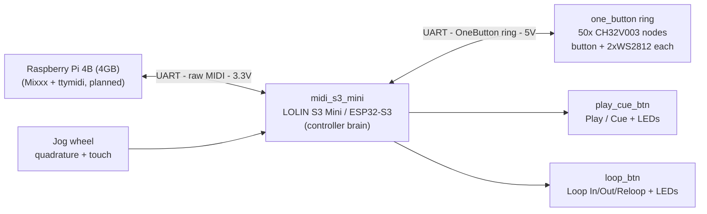

# TriMixxx

A custom CDJ (Compact Disc Jockey) unit built from scratch around a Raspberry Pi, designed to run [Mixxx](https://mixxx.org/) DJ software. It reuses an original CDJ's buttons and jog wheel behind custom PCBs and a 3D-printed chassis for an authentic DJ feel, and reads Rekordbox-formatted USB sticks — no laptop required.


## What is this?

TriMixxx replaces the internals of a CDJ with modern, open-source-friendly hardware while keeping the physical controls that DJs know and love. Plug in a Rekordbox-formatted USB stick, and you're ready to mix.

Where the CDJ's original main board did everything, TriMixxx today is a **small distributed system**: a Raspberry Pi runs Mixxx, an ESP32-S3 acts as the controller brain that reads every physical control and speaks MIDI, and a swarm of tiny satellite boards handle the buttons and the LED ring. They all talk over plain TTL UART.

## How we got here (a short history)

This project has been through several complete redesigns. It's worth keeping the lineage straight:

1. **One board to rule them all.** The first idea was a single monolithic PCB carrying *everything*: a Raspberry Pi CM5, a TI PCM5242 I²S DAC with RCA + headphone outputs, USB-C PD power (CH224K + SY8368AQQC buck), dual micro-HDMI, the USB stick ports, and an **ATmega32U4** presenting the CDJ's buttons/jog/fader to the Pi as a USB-MIDI device — all on one board. It was fully routed (`screenshots/CDJ-MainBoard-v1_fully_routed.png`, and the `*_2026-02-17.png` schematic captures) but never became the working unit; cramming compute, audio, power, and a controller onto one board made every revision expensive and every mistake fatal.

2. **Breaking it apart.** The controller was split out onto its own board. `boards/midi-laser-pcb` was the first standalone MIDI-controller PCB — it was fabricated, then abandoned in favour of a cleaner design.

3. **Where it is now.** `boards/midi_s3_mini` is the current controller board (fabricated), hosting a **LOLIN S3 Mini (ESP32-S3)**. The audio DAC and power delivery are no longer TriMixxx's job — a Raspberry Pi handles Mixxx and audio directly, and the S3 is purely the controller brain. The controls are spread across small purpose-built satellite boards, all of them already fabricated.

The old monolithic design is preserved in this README's history and in `screenshots/` as a record of the road not taken.

## Current architecture


```mermaid
flowchart LR
    Pi["Raspberry Pi 4B (4GB)<br/>(Mixxx + ttymidi, planned)"]
    S3["midi_s3_mini<br/>LOLIN S3 Mini / ESP32-S3<br/>(controller brain)"]
    Ring["one_button ring<br/>50x CH32V003 nodes<br/>button + 2xWS2812 each"]
    PlayCue["play_cue_btn<br/>Play / Cue + LEDs"]
    Loop["loop_btn<br/>Loop In/Out/Reloop + LEDs"]
    Jog["Jog wheel<br/>quadrature + touch"]

    Pi <-->|"UART - raw MIDI - 3.3V"| S3
    S3 <-->|"UART - OneButton ring - 5V"| Ring
    S3 --> PlayCue
    S3 --> Loop
    Jog --> S3
```

- **Raspberry Pi 4B (4 GB)** runs Mixxx. The plan is for [`ttymidi`](https://github.com/cjbarnes18/ttymidi) on the Pi to turn the UART link into an ALSA MIDI device, so Mixxx sees TriMixxx as a standard MIDI controller (not yet set up on the Pi). This link is 3.3 V on both ends (Pi GPIO ↔ S3), so no level shifting is needed.
- **midi_s3_mini (ESP32-S3)** is the controller brain. It reads every physical control, translates it to MIDI for the Pi, and drives LEDs from the MIDI feedback Mixxx sends back. It runs `firmwares/trimixxx-midi`.
- **one_button ring** is a daisy-chained ring of up to 50 CH32V003 nodes, each with one button and two WS2812 LEDs, connected to the S3 over a single UART ring. See [The OneButton Protocol](#the-onebutton-protocol) below.
- **play_cue_btn** and **loop_btn** are dumb button+LED satellite boards (no MCU) wired to the S3.
- The **jog wheel** (quadrature encoder + capacitive touch) wires directly into the S3, decoded by the ESP32's hardware pulse counter (PCNT).

### MIDI map

All MIDI addresses live in one place — `firmwares/trimixxx-midi/lib/PiLink/MidiMap.hpp` — and the Mixxx mapping matches them exactly. One deck (v1) → MIDI channel 1.

| Control | MIDI |
|---|---|
| Ring pads (node *i*) | Note `0x00 + i` (0..49), velocity = white LED brightness |
| Play / Cue | Notes `0x3C` / `0x3D` |
| Loop In / Out / Reloop | Notes `0x3E` / `0x3F` / `0x40` |
| Track encoder | Note `0x41` (press) + CC `0x10` (relative: 1=up, 127=down) |
| Jog wheel | Note `0x42` (touch/scratch) + CC `0x11` (relative ticks) |
| Tempo fader | CC `0x12` (absolute 0..127) |

> Status: ring pads and the jog wheel are implemented and live. The encoder, tempo fader, and the play/cue and loop boards have reserved MIDI addresses and Mixxx bindings — their S3 driver modules are still being built.

## Boards

All KiCad projects live under `boards/`. Every board below has been fabricated.

| Board | Role | MCU | Status |
|---|---|---|---|
| `midi_s3_mini` | Controller brain: reads all controls, MIDI bridge to the Pi, drives LEDs, jog-wheel input | LOLIN S3 Mini (ESP32-S3) | **Current** |
| `one_button` | Ring node: one button + 2× WS2812, cut-through UART relay. Every node is identical. | CH32V003F4U6 | **Current** |
| `play_cue_btn` | Play + Cue buttons with LEDs (driven by the S3) | none | **Current** |
| `loop_btn` | Loop In/Out/Reloop buttons with LEDs (driven by the S3) | none | **Current** |
| `midi-laser-pcb` | First standalone MIDI-controller board | — | Fabricated, **abandoned** (superseded by `midi_s3_mini`) |

## Firmwares

| Firmware | Runs on | What it is |
|---|---|---|
| `trimixxx-midi` | midi_s3_mini (ESP32-S3) | The master. PlatformIO/Arduino. Reads the OneButton ring + jog wheel + deck controls and bridges them to the Pi as MIDI. Master of the OneButton ring. |
| `onebutton` | one_button ring nodes (CH32V003) | Bare-metal [ch32fun](https://github.com/cnlohr/ch32fun). `onebutton_node` (the identical binary every ring node runs) and `onebutton_selftest` (single-board bring-up). |
| `swio-adapter` | A spare Pro Micro | Turns an Arduino into a `minichlink` SWIO programmer for flashing the CH32V003 nodes — no dedicated programmer needed. Git submodule. |
| `ArduinoMIDI` | (historical) | Early ATmega-based MIDI + jog-wheel test sketches from the monolithic-board era. |

## The OneButton Protocol

The button ring runs a purpose-built **cut-through UART ring protocol**. A single fixed-length frame, authored by the S3 master, circulates once around the ring and returns carrying every node's button state; LED colours travel outward on the same frame. Each node forwards bytes as they arrive, editing only the bytes in its own slot, so latency scales as `frame_time + N·byte_time` rather than `N·frame_time`. Node addresses are assigned positionally at boot, so all nodes run an identical binary with no per-unit configuration.

Full wire format, timing, and failure model: **[`firmwares/onebutton/onebutton-protocol.md`](firmwares/onebutton/onebutton-protocol.md)**.

## Related work: ProLink compatibility

`prolinks-compat/` researches Pioneer's proprietary **CDJ ProLink** Ethernet protocol, with the goal of letting TriMixxx discover and share libraries with real CDJs on the same network (linked playback). See `prolinks-compat/CLAUDE.md`.

## Chassis

Designed in Fusion 360 to fit the original CDJ form factor — a custom top panel with cutouts for the jog wheel, buttons, and connectors, plus a bottom tray.


## Repository structure

```
boards/                     KiCad PCB projects
├── midi_s3_mini/               Current controller board (ESP32-S3)
├── one_button/                 OneButton ring node (CH32V003)
├── play_cue_btn/               Play + Cue buttons
├── loop_btn/                   Loop buttons
└── midi-laser-pcb/             Abandoned first controller board

firmwares/                  Embedded firmware
├── trimixxx-midi/              S3 master (PlatformIO / Arduino)
├── onebutton/                  Ring node + selftest (ch32fun)
├── swio-adapter/               CH32V003 SWIO programmer (submodule)
└── ArduinoMIDI/                Historical ATmega sketches

ch32fun/                    ch32fun toolkit (submodule)
prolinks-compat/            Pioneer ProLink protocol research
handmade_pcb/               Hand-etched PCB experiments
screenshots/                Renders + schematics (incl. the monolithic-board history)
```

## Tools used

- **KiCad** — schematic capture and PCB layout
- **PlatformIO** + **Arduino** — ESP32-S3 firmware
- **ch32fun** — bare-metal CH32V003 firmware and `minichlink` flashing
- **Fusion 360** — mechanical design
- **JLCPCB** — PCB fabrication and assembly

## License

This is a personal hardware project. Feel free to use it as reference for your own builds.

---

## Appendix: the monolithic board (historical)

The original single-board design is no longer built, but its details are recorded here for posterity. It centred on a **Raspberry Pi CM5** (dual DF40 100-pin connectors), a **TI PCM5242** I²S DAC feeding RCA + 6.35 mm + 3.5 mm outputs, an **ATmega32U4** USB-MIDI controller reading all the CDJ controls, USB-C PD power (**CH224K** negotiating 20 V @ 3 A, **SY8368AQQC** buck to 5 V, **AP2112K** LDOs), dual micro-HDMI, gigabit Ethernet, and the USB stick ports (**HD3SS3220**/**HD3SS3212** muxing, **USBLC6-2SC6** ESD protection) — roughly 160 components on one PCB.

### Schematics

| Sheet | File |
|---|---|
| Audio outputs (DAC, RCA, headphones) | `screenshots/audio_2026-02-17.png` |
| MIDI / ATmega controller | `screenshots/midi_arduino_2026-02-17.png` |
| Power delivery (USB-C PD, buck, LDOs) | `screenshots/power_delivery_2026-02-17.png` |
| USB ports (mux, ESD) | `screenshots/usb_2026-02-17.png` |
| Fully routed PCB | `screenshots/CDJ-MainBoard-v1_fully_routed.png` |

### SPICE simulations

- DAC output (PCM5242): `screenshots/dac_spice.png`
- Buck converter (SY8368AQQC): `screenshots/buck_converter_spice.png`
