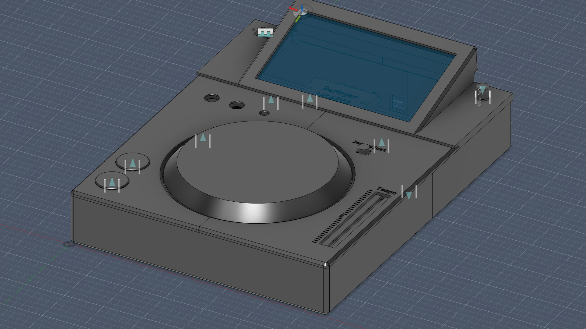
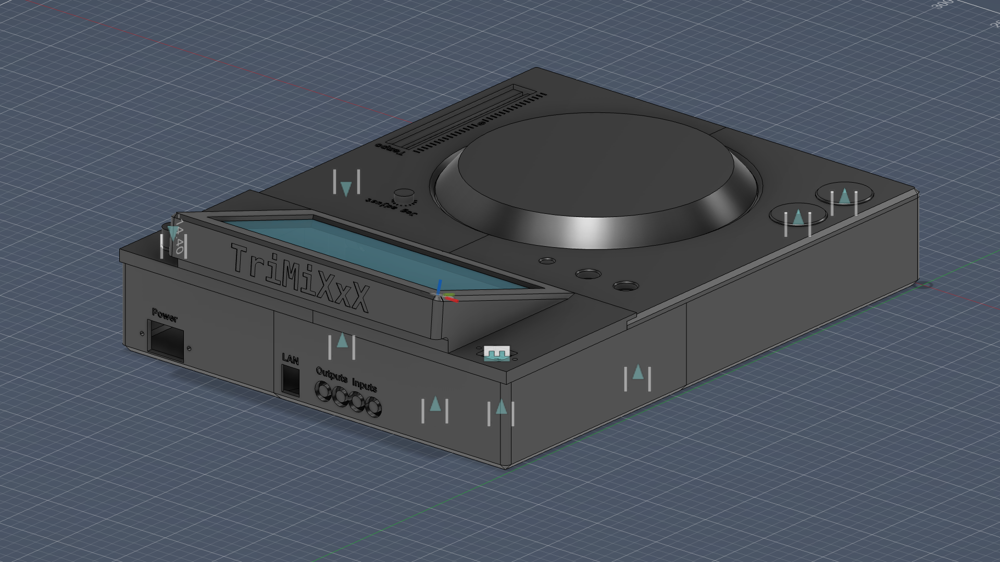
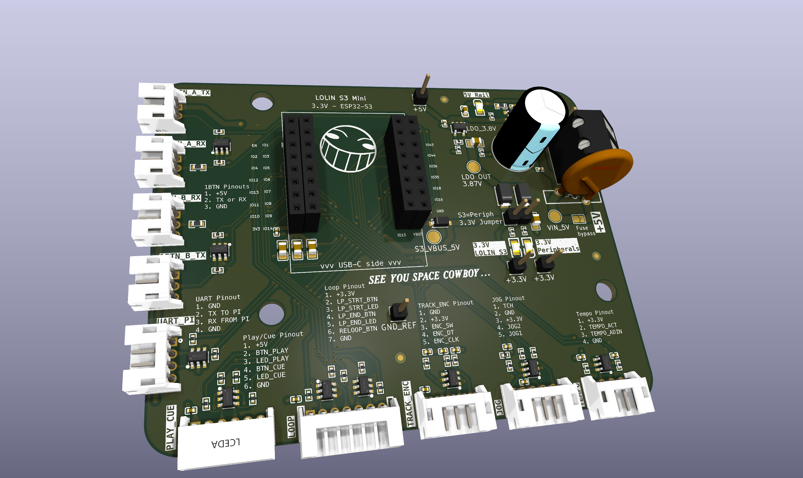
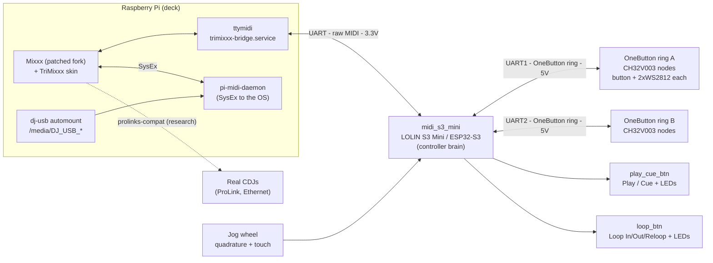
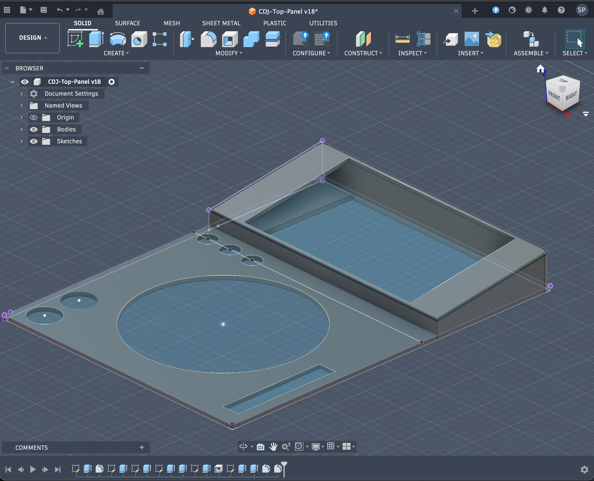

# TriMixxx

A custom CDJ (Compact Disc Jockey) unit built from scratch around a Raspberry Pi, designed to run [Mixxx](https://mixxx.org/) DJ software. It reuses an original CDJ's buttons and jog wheel behind custom PCBs and a 3D-printed chassis for an authentic DJ feel, and reads Rekordbox-formatted USB sticks — no laptop required.




## What is this?

TriMixxx replaces the internals of a CDJ with modern, open-source-friendly hardware while keeping the physical controls that DJs know and love. Plug in a Rekordbox-formatted USB stick, and you're ready to mix.

Where the CDJ's original main board did everything, TriMixxx today is a **small distributed system**: a Raspberry Pi runs a patched Mixxx behind a custom CDJ-style skin, an ESP32-S3 acts as the controller brain that reads every physical control and speaks MIDI, and a swarm of tiny satellite boards handle the buttons and the LED rings. They all talk over plain TTL UART.

It is a working deck, not a plan: the Pi boots straight into Mixxx, the USB stick automounts, the S3's controls drive it, and Mixxx's feedback drives the LEDs back. Alongside that, `prolinks-compat/` has reverse-engineered Pioneer's ProLink protocol far enough that a real CDJ-2000NXS browses and plays tracks served by this project.

## How we got here (a short history)

This project has been through several complete redesigns. It's worth keeping the lineage straight:

1. **One board to rule them all.** The first idea was a single monolithic PCB carrying *everything*: a Raspberry Pi CM5, a TI PCM5242 I²S DAC with RCA + headphone outputs, USB-C PD power (CH224K + SY8368AQQC buck), dual micro-HDMI, the USB stick ports, and an **ATmega32U4** presenting the CDJ's buttons/jog/fader to the Pi as a USB-MIDI device — all on one board. It was fully routed (`screenshots/CDJ-MainBoard-v1_fully_routed.png`, and the `*_2026-02-17.png` schematic captures) but never became the working unit; cramming compute, audio, power, and a controller onto one board made every revision expensive and every mistake fatal.

2. **Breaking it apart.** The controller was split out onto its own board. `boards/midi-laser-pcb` was the first standalone MIDI-controller PCB — it was fabricated, then abandoned in favour of a cleaner design.

3. **Where it is now.** `boards/midi_s3_mini` is the current controller board (fabricated), hosting a **LOLIN S3 Mini (ESP32-S3)**. The audio DAC and power delivery are no longer TriMixxx's job — a Raspberry Pi handles Mixxx and audio directly, and the S3 is purely the controller brain. The controls are spread across small purpose-built satellite boards, all of them already fabricated.



The old monolithic design is preserved in this README's history and in `screenshots/` as a record of the road not taken.

## Current architecture


```mermaid
flowchart LR
    subgraph PiBox["Raspberry Pi (deck)"]
        Mixxx["Mixxx (patched fork)<br/>+ TriMixxx skin"]
        Tty["ttymidi<br/>trimixxx-bridge.service"]
        Daemon["pi-midi-daemon<br/>(SysEx to the OS)"]
        Usb["dj-usb automount<br/>/media/DJ_USB_*"]
    end

    S3["midi_s3_mini<br/>LOLIN S3 Mini / ESP32-S3<br/>(controller brain)"]
    RingA["OneButton ring A<br/>CH32V003 nodes<br/>button + 2xWS2812 each"]
    RingB["OneButton ring B<br/>CH32V003 nodes"]
    PlayCue["play_cue_btn<br/>Play / Cue + LEDs"]
    Loop["loop_btn<br/>Loop In/Out/Reloop + LEDs"]
    Jog["Jog wheel<br/>quadrature + touch"]
    CDJ["Real CDJs<br/>(ProLink, Ethernet)"]

    Mixxx <--> Tty
    Mixxx <-->|SysEx| Daemon
    Usb --> Daemon
    Tty <-->|"UART - raw MIDI - 3.3V"| S3
    S3 <-->|"UART1 - OneButton ring - 5V"| RingA
    S3 <-->|"UART2 - OneButton ring - 5V"| RingB
    S3 --> PlayCue
    S3 --> Loop
    Jog --> S3
    Mixxx -.->|"prolinks-compat (research)"| CDJ
```

- **Raspberry Pi 4B (4 GB)** runs Mixxx — specifically [our own fork](https://github.com/usr-ein/mixxx) (the `mixxx/` submodule), branched off the 2.5.6 tag and carrying deck-specific patches. [`ttymidi`](https://github.com/usr-ein/ttymidi) turns the UART link into an ALSA MIDI device, so Mixxx sees TriMixxx as a standard MIDI controller. That link is 3.3 V on both ends (Pi GPIO ↔ S3), so no level shifting is needed.
- **midi_s3_mini (ESP32-S3)** is the controller brain. It reads every physical control, translates it to MIDI for the Pi, and drives LEDs from the MIDI feedback Mixxx sends back. It runs `firmwares/trimixxx-midi`.
- **Two OneButton rings** hang off the S3, one per UART (A on UART1, B on UART2). Each is a daisy chain of up to 50 CH32V003 nodes, every node carrying one button and two WS2812 LEDs. Nodes enumerate themselves at boot, so a ring self-sizes to however many boards are actually populated (7 and 6 today). See [The OneButton Protocol](#the-onebutton-protocol) below.
- **play_cue_btn** and **loop_btn** are dumb button+LED satellite boards (no MCU) wired to the S3.
- The **jog wheel** (optical quadrature encoder + capacitive touch) wires directly into the S3, decoded by the ESP32's hardware pulse counter (PCNT).

### Signal chain: pressing Play

A worked example of what happens end-to-end, from copper to Mixxx. Every other button on the deck follows the same path.

**Press.** The switch closes and shorts the on-board 100 nF debounce cap to ground, so the GPIO (held high by the S3's internal pull-up) falls low over the RC's time constant — the buttons are active-low. `buttonPollTask` on core 1 samples the pin every `BTN_POLL_MS` = 2 ms and needs `DEBOUNCE` = 3 consecutive stable samples before it accepts the edge, so the RC's slow ramp and any contact bounce are both ignored (~6 ms to accept). Polling is deliberate here rather than an edge interrupt, which slow RC edges tend to upset on the ESP32. On accepting the edge, `poll()` updates the debounced `level` and sets a **sticky press latch**, so the press can't be missed even if the main loop stalls. The main loop (`CTRL_POLL_MS` = 2 ms) calls `playCue.pressed()`, which consumes the latch, and `btnToNote()` hands it to `PiLink`, which writes a Note-On (note `0x3C`, velocity 127) to UART0 at 115200 baud. `ttymidi` on the Pi turns those raw MIDI bytes into an ALSA MIDI event; Mixxx matches `0x3C` in `TriMixxx.midi.xml` and calls `TriMixxx.play`, which toggles the deck's `play` control.

**Held.** Nothing repeats. The sticky latch fires exactly once per press; `btnToNote` keeps a `pending` flag so it knows a Note-Off is still owed. Meanwhile Mixxx sends `play_indicator` back on the same note `0x3C` — `pi.poll()` runs every main-loop pass (no 2 ms gate, for the lowest LED latency) and drives the button's LED from that feedback, so the LED reflects Mixxx's actual state rather than the button's.

**Release.** The switch opens, the pull-up recharges the cap through the RC, and the pin rises. The poll task sees 3 stable high samples, clears `level`, and the next main-loop pass sees `pending && !held` and sends the Note-Off. Mixxx's `TriMixxx.play` ignores value 0, so the release is a no-op there — it just keeps the On/Off pairing well-formed on the wire.

### MIDI map

All MIDI addresses live in one place — `firmwares/trimixxx-midi/lib/PiLink/MidiMap.hpp` — and the Mixxx mapping (`mixxx_config/TriMixxx.midi.xml`) matches them exactly. One deck (v1) → MIDI channel 1.

| Control | MIDI | Mixxx |
|---|---|---|
| Ring A pads (node *i*) | Note `0x00 + i` | Tempo range, keylock, 8/4-beat loops, loop double/halve, back |
| Ring B pads (node *i*) | Note `0x43 + i` | Hotcues 1–4, slip, key-sync indicator |
| Play / Cue | Notes `0x3C` / `0x3D` | `play` (toggle) / `cue_default` |
| Loop In / Out / Reloop | Notes `0x3E` / `0x3F` / `0x40` | `loop_in` / `loop_out` / `reloop_toggle` |
| Track encoder | Note `0x41` (press) + CC `0x10` (relative: 1=up, 127=down) | Browse + load |
| Jog wheel | Note `0x42` (touch/scratch) + CC `0x11` (relative ticks) | Scratch when touched, pitch bend otherwise |
| Tempo fader | CC `0x12` MSB + CC `0x32` LSB (14-bit absolute 0..16383, 8192 = center) | `rate` |

Both pad ranges reserve 50 notes even though fewer nodes are populated today, so growing a ring never renumbers anything.

The tempo fader follows the standard MIDI 14-bit convention — the LSB rides on `MSB + 32` (18 + 32 = 50 = `0x32`) — and Mixxx binds the pair to `[Channel1] rate` with `<fourteen-bit-msb/>` / `<fourteen-bit-lsb/>`. The extra resolution is worth the second CC: a single 7-bit CC would quantise the whole pitch range to 128 steps. The fader is read ratiometrically (wiper minus a live center-tap reference) so the center detent lands on 8192 without calibration.

LED feedback comes back on the same notes. A Note-On velocity only sets *white* brightness, so full RGB travels as SysEx instead — `F0 7D <cmd> <node> <colour nibbles> F7`, with each 8-bit channel split into two data bytes so a 7-bit SysEx payload can still express 0..255 per channel (`0x01` = ring A, `0x03` = ring B). `0x02` reboots the S3, and requires the magic `"RST"` so a stray SysEx can't reset the deck mid-set.

## Boards

All KiCad projects live under `boards/`. Every board below has been fabricated.

| Board | Role | MCU | Status |
|---|---|---|---|
| `midi_s3_mini` | Controller brain: reads all controls, MIDI bridge to the Pi, drives LEDs, jog-wheel input | LOLIN S3 Mini (ESP32-S3) | **Current** |
| `one_button` | Ring node: one button + 2× WS2812, cut-through UART relay. Every node is identical. | CH32V003F4U6 | **Current** |
| `play_cue_btn` | Play + Cue buttons with LEDs (driven by the S3) | none | **Current** |
| `loop_btn` | Loop In/Out/Reloop buttons with LEDs (driven by the S3) | none | **Current** |
| `midi-laser-pcb` | First standalone MIDI-controller board | — | Fabricated, **abandoned** (superseded by `midi_s3_mini`) |

## Firmwares

| Firmware | Runs on | What it is |
|---|---|---|
| `trimixxx-midi` | midi_s3_mini (ESP32-S3) | The master. PlatformIO/Arduino. Reads both OneButton rings + jog wheel + deck controls and bridges them to the Pi as MIDI. Master of both rings. |
| `onebutton` | one_button ring nodes (CH32V003) | Bare-metal [ch32fun](https://github.com/cnlohr/ch32fun). `onebutton_node` (the identical binary every ring node runs) and `onebutton_selftest` (single-board bring-up). |
| `swio-adapter` | A spare Pro Micro | Turns an Arduino into a `minichlink` SWIO programmer for flashing the CH32V003 nodes — no dedicated programmer needed. Git submodule. |
| `ArduinoMIDI` | (historical) | Early ATmega-based MIDI + jog-wheel test sketches from the monolithic-board era. |

Every driver in `trimixxx-midi` is written and live: both rings, jog wheel, tempo fader, track encoder, play/cue board and loop board. A single `DECK_DEBUG` switch at the top of `main.cpp` swaps the MIDI loop for each module's own self-test.

## The OneButton Protocol

The button rings run a purpose-built **cut-through UART ring protocol**. A single fixed-length frame, authored by the S3 master, circulates once around the ring and returns carrying every node's button state; LED colours travel outward on the same frame. Each node forwards bytes as they arrive, editing only the bytes in its own slot, so latency scales as `frame_time + N·byte_time` rather than `N·frame_time`. Node addresses are assigned positionally at boot, so all nodes run an identical binary with no per-unit configuration.

Full wire format, timing, and failure model: **[`firmwares/onebutton/onebutton-protocol.md`](firmwares/onebutton/onebutton-protocol.md)**.

## The Pi side

The deck's software is split into four pieces, each with its own README:

| Piece | What it is |
|---|---|
| `mixxx/` (submodule) | **Our Mixxx fork.** Forked at 2.5.6, carrying deck patches: downbeat highlighting in the waveform (`DownbeatColor` skin node), Rekordbox beat-grid phase preserved via the intro cue, and a `[Rekordbox], refresh` control so a stick mounted mid-set can be picked up from a script. Built for arm64 in Docker and installed over SSH. |
| `mixxx_config/` | Everything under `~/.mixxx`: the controller mapping (`TriMixxx.midi.xml` + `.scripts.js`), the `PiMidiDaemon` mapping, `soundconfig.xml`, and `TriMixxx_skin/` — a single-deck CDJ-style skin for the 1024×600 touchscreen. `upload.sh` validates every XML *before* anything leaves the machine, because Qt silently falls back to the default skin on a malformed one. |
| `pi_config/` | The system side: `trimixxx-bridge.service` (ttymidi, ordered before Mixxx so the MIDI port exists when Mixxx enumerates devices), `cpu-governor.service` (the `performance` governor — `ondemand` was the measured cause of xruns while scratching), and `dj-usb/` (udev + systemd read-only automount of DJ sticks). |
| `pi-midi-daemon/` | A small Go daemon for the things Mixxx cannot do. Mixxx's script engine has no file, process or network access, so **MIDI is the only channel out** — the daemon takes SysEx commands (shutdown, reboot) and reports events back (a DJ stick was mounted or removed). Ships as a fully static musl binary, so there is nothing to install on the Pi. |

## ProLink compatibility

`prolinks-compat/` reverse-engineers Pioneer's proprietary **CDJ ProLink** Ethernet protocol so TriMixxx can share libraries with real CDJs on the same network. It is a substantial subproject in its own right — a Python proof-of-concept plus a written specification — and both directions now work against real hardware (two CDJ-2000NXS):

- **Consume:** discover players passively, then pull a deck's `export.pdb` over NFS and list its tracks. The fetched database is byte-identical to the same file read off the physically ejected stick.
- **Serve:** a real CDJ-2000NXS sees us on its LINK screen, browses all eleven categories with drill-downs, sorting, search and harmonic key matching, and **loads and plays tracks** (MP3, AAC, WAV, AIFF) with artwork, hot cues and both waveforms. The last browse session was 568 requests with zero errors.

The protocol as observed is written up in [`prolinks-compat/docs/PROTOCOL.md`](prolinks-compat/docs/PROTOCOL.md), with the evidence behind every claim in `docs/FINDINGS.md` and current state in `STATUS.md`. The end goal is to port the validated approach into Mixxx (C++/Qt) and upstream it.

## Chassis

Designed in Fusion 360 to fit the original CDJ form factor — a custom top panel with cutouts for the jog wheel, buttons, and connectors, plus a bottom tray. `ref_sizes/` holds the measured references (CDJ-1000MK3 / 2000NXS2 / 3000 dimensions, jog wheel, screen) the design is built from.



## Repository structure

```
boards/                     KiCad PCB projects
├── midi_s3_mini/               Current controller board (ESP32-S3)
├── one_button/                 OneButton ring node (CH32V003)
├── play_cue_btn/               Play + Cue buttons
├── loop_btn/                   Loop buttons
└── midi-laser-pcb/             Abandoned first controller board

firmwares/                  Embedded firmware
├── trimixxx-midi/              S3 master (PlatformIO / Arduino)
├── onebutton/                  Ring node + selftest (ch32fun)
├── swio-adapter/               CH32V003 SWIO programmer (submodule)
└── ArduinoMIDI/                Historical ATmega sketches

mixxx/                      Our Mixxx fork -- the build the deck runs (submodule)
mixxx_config/               ~/.mixxx: mapping, scripts, skin, sound config
pi_config/                  Pi system config: systemd units, udev, USB automount
pi-midi-daemon/             Go daemon: SysEx <-> OS actions and USB events

prolinks-compat/            Pioneer ProLink protocol research + Python PoC
ch32fun/                    ch32fun toolkit (submodule)
handmade_pcb/               Hand-etched PCB experiments
datasheet/                  Datasheets for the parts used
ref_sizes/                  Measured CDJ dimensions the chassis is built from
screenshots/                Renders + schematics (incl. the monolithic-board history)
```

## Tools used

- **KiCad** — schematic capture and PCB layout
- **PlatformIO** + **Arduino** — ESP32-S3 firmware
- **ch32fun** — bare-metal CH32V003 firmware and `minichlink` flashing
- **Fusion 360** — mechanical design
- **JLCPCB** — PCB fabrication and assembly
- **Go**, **Python** (`uv`) — Pi daemon and ProLink proof-of-concept

## License

Copyright (C) 2026 Samuel Prevost and contributors.

TriMixxx is free software: you can redistribute it and/or modify it under the terms of the **GNU General Public License version 3** or (at your option) any later version. The full text is in [`LICENSE`](LICENSE). This covers everything in the repository — firmware, host software, hardware sources and documentation alike — except:

- **`prolinks-compat/`**, which is **GPLv2-or-later** on purpose, so it stays compatible with Mixxx and can be upstreamed. GPLv2-or-later code may be used under GPLv3, so this is compatible with the rest of the project; see `prolinks-compat/LICENSE`.
- **Submodules** (`mixxx/`, `ch32fun/`, `firmwares/swio-adapter/`, `mixxx_config/ttymidi/`, the Keebio libraries), which keep their own upstream licenses.

---

## Appendix: the monolithic board (historical)

The original single-board design is no longer built, but its details are recorded here for posterity. It centred on a **Raspberry Pi CM5** (dual DF40 100-pin connectors), a **TI PCM5242** I²S DAC feeding RCA + 6.35 mm + 3.5 mm outputs, an **ATmega32U4** USB-MIDI controller reading all the CDJ controls, USB-C PD power (**CH224K** negotiating 20 V @ 3 A, **SY8368AQQC** buck to 5 V, **AP2112K** LDOs), dual micro-HDMI, gigabit Ethernet, and the USB stick ports (**HD3SS3220**/**HD3SS3212** muxing, **USBLC6-2SC6** ESD protection) — roughly 160 components on one PCB.

### Schematics

| Sheet | File |
|---|---|
| Audio outputs (DAC, RCA, headphones) | `screenshots/audio_2026-02-17.png` |
| MIDI / ATmega controller | `screenshots/midi_arduino_2026-02-17.png` |
| Power delivery (USB-C PD, buck, LDOs) | `screenshots/power_delivery_2026-02-17.png` |
| USB ports (mux, ESD) | `screenshots/usb_2026-02-17.png` |
| Fully routed PCB | `screenshots/CDJ-MainBoard-v1_fully_routed.png` |

### SPICE simulations

- DAC output (PCM5242): `screenshots/dac_spice.png`
- Buck converter (SY8368AQQC): `screenshots/buck_converter_spice.png`
