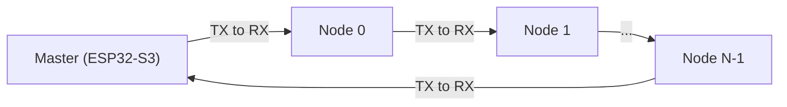
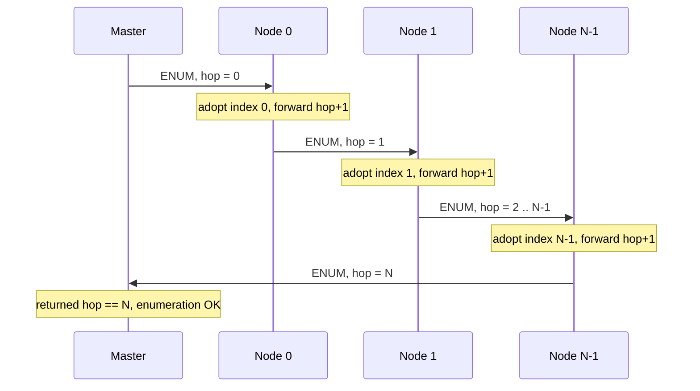
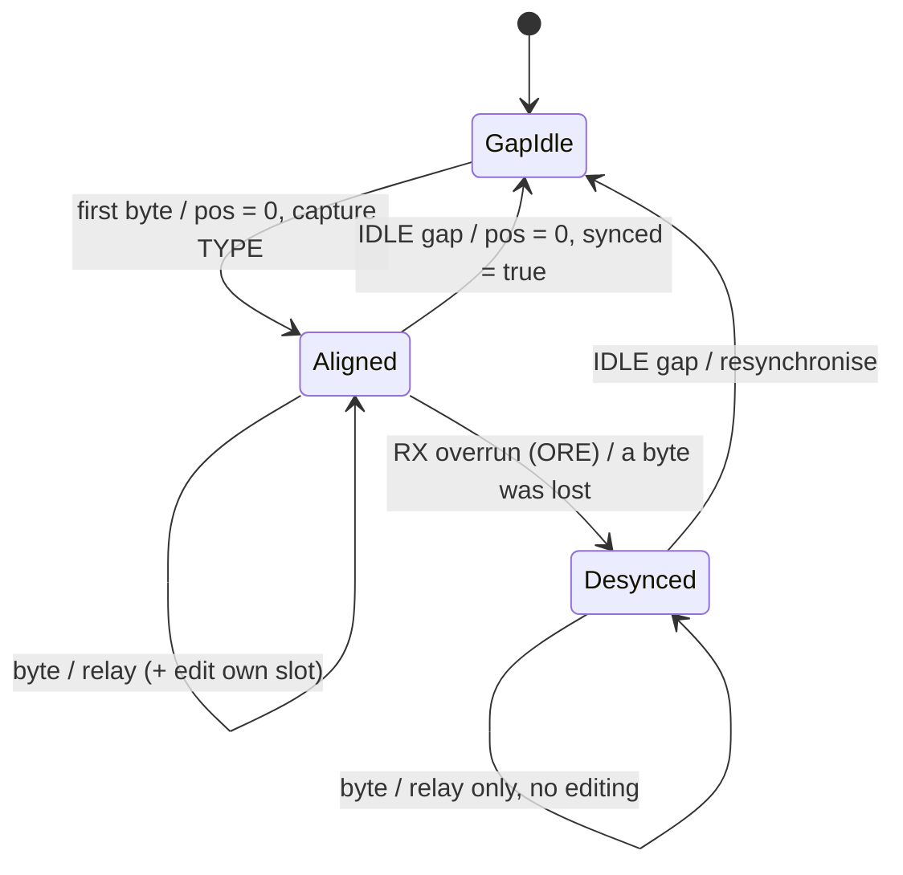
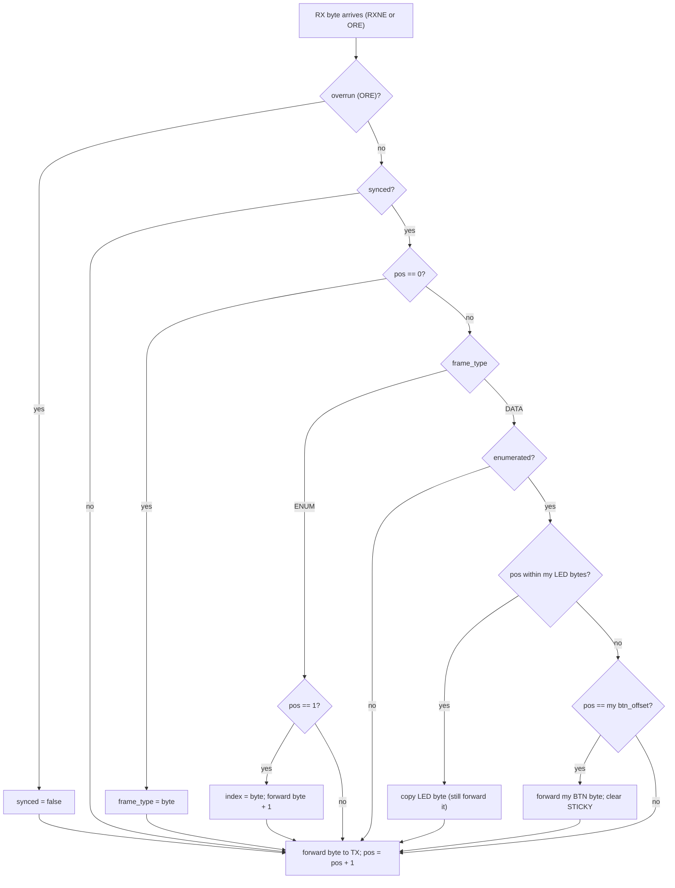

# The OneButton Protocol

**A cut-through UART ring protocol for daisy-chained button/LED nodes.**

| | |
|---|---|
| **Version** | 1.0.0 |
| **Date** | 2026-07-07 |
| **Status** | Draft |
| **Reference deployment** | TriMixxx — 50-node ring, CH32V003 nodes, ESP32-S3 master |
| **Implementation status** | Node behaviour implemented and validated on a single board (reference firmware). Master and full-ring operation are specified herein; master implementation pending. |

---

## Table of contents

1. [Introduction](#1-introduction)
2. [Requirements language](#2-requirements-language)
3. [Terminology](#3-terminology)
4. [Topology and roles](#4-topology-and-roles)
5. [Physical layer](#5-physical-layer)
6. [Framing](#6-framing)
7. [Frame formats](#7-frame-formats)
8. [Addressing and enumeration](#8-addressing-and-enumeration)
9. [Cut-through relay processing](#9-cut-through-relay-processing)
10. [Button semantics](#10-button-semantics)
11. [LED semantics](#11-led-semantics)
12. [Integrity](#12-integrity)
13. [Timing](#13-timing)
14. [Error handling and resynchronisation](#14-error-handling-and-resynchronisation)
15. [Reliability and failure model](#15-reliability-and-failure-model)
16. [Master requirements](#16-master-requirements)
17. [Node requirements](#17-node-requirements)
18. [Constants](#18-constants)
19. [Reference pseudocode](#19-reference-pseudocode)
20. [Version history](#20-version-history)

---

## 1. Introduction

The OneButton Protocol carries button state and per-LED colour between a single
**master** and an ordered chain of **nodes** connected as a **UART ring**. Each
node reads one push-button and drives a small number of addressable RGB LEDs.

The protocol is designed for a moderately large number of nodes (the reference
deployment uses 50) at low latency, using only point-to-point TTL UART links and
one microcontroller per node. Its defining property is **cut-through relaying**:
a node forwards each byte as it arrives, editing only the bytes belonging to its
own slot, so latency scales as `frame_time + N·byte_time` rather than
`N·frame_time`.

A single frame, authored by the master, circulates once around the ring and
returns to the master carrying every node's button state — a *circulating
summation frame*. LED commands travel outward on the same frame. Node addresses
are assigned positionally at boot, so nodes require no per-unit configuration and
all run an identical binary.

This document specifies the wire format, the byte-level processing rules, the
timing constraints, and the error and failure behaviour required to interoperate.

---

## 2. Requirements language

The key words **MUST**, **MUST NOT**, **REQUIRED**, **SHALL**, **SHALL NOT**,
**SHOULD**, **SHOULD NOT**, **RECOMMENDED**, **MAY**, and **OPTIONAL** in this
document are to be interpreted as described in RFC 2119.

---

## 3. Terminology

- **Master** — the single device that originates all frames, controls timing, and
  is the sole consumer of button state and source of LED state.
- **Node** — a device in the chain that relays frames, drives its LEDs from the
  frame, and injects its button state into the frame.
- **Ring** — the closed loop: master TX → node 0 RX, node *k* TX → node *k+1* RX,
  last node TX → master RX.
- **Frame** — a fixed-length sequence of bytes delimited by an inter-frame idle
  gap.
- **Slot** — the fixed-width region of a DATA frame belonging to one node.
- **Index** — a node's position in the chain, assigned during enumeration
  (0 for the node nearest the master).
- **N** — the number of nodes in the ring.
- **Byte-time** — the on-wire duration of one UART character (10 bit-times for
  8N1).
- **Idle gap** — a period during which the master holds the line idle (mark)
  between frames; used as the frame boundary and as the LED latch window.

---

## 4. Topology and roles

Nodes are wired as a unidirectional ring. Each link is an independent
point-to-point UART connection: an upstream device's TX drives the downstream
device's RX.



- There is exactly **one** master. There MUST NOT be more than one master on a
  ring.
- Data flow is unidirectional around the ring. A node's RX is fed only by its
  upstream neighbour; its TX feeds only its downstream neighbour.
- Each node re-clocks the data (it re-receives and re-transmits every byte), so
  UART clock error does not accumulate along the chain; each link sees only the
  mismatch between its own two endpoints.

---

## 5. Physical layer

### 5.1 Electrical

- Nodes operate at **5 V** logic. Links between nodes are 5 V TTL UART, idle-high.
- All devices on the ring MUST share a common ground.
- Where the master operates at a different logic voltage (e.g. 3.3 V), level
  translation MUST be provided **only at the master boundary**:
  - The master's TX into the first node MUST be translated up to the node's input
    threshold.
  - The last node's TX into the master's RX MUST be translated down to the
    master's tolerated input voltage.
- The inter-node links require no translation when all nodes share the same logic
  voltage.

### 5.2 UART parameters

- Format: **8 data bits, no parity, 1 stop bit (8N1)**. 10 bit-times per byte.
- Bit order: LSB first (standard UART).
- All devices on a ring MUST use the **same baud rate**.
- **RECOMMENDED operating baud: 1,000,000 (1 Mbps).** The floor for reliable
  operation is 500,000. Higher rates (up to ~3 Mbps) are possible but reduce
  timing margin and are NOT RECOMMENDED without measurement.
- Baud rates SHOULD be chosen to divide the node clock exactly. For a 48 MHz node
  clock, 500 kbps (÷96) and 1 Mbps (÷48) are exact.

---

## 6. Framing

The protocol uses **fixed-length framing delimited by an inter-frame idle gap**.
There is no in-band start/stop delimiter and no byte stuffing; any byte value may
appear anywhere in a frame.

- The master transmits a complete frame back-to-back, then holds the line idle for
  at least the idle gap (see [§13](#13-timing)) before the next frame.
- A node detects the end of a frame by observing the line idle for longer than one
  character time (the UART **IDLE** condition). On this event the node resets its
  intra-frame byte position to zero and re-synchronises (see
  [§9](#9-cut-through-relay-processing)).
- The **first byte** of every frame is the frame **type** and determines the
  frame's structure.

| Type value | Name | Meaning |
|---|---|---|
| `0xA5` | DATA | Circulating summation frame (LED out, button in) |
| `0x5A` | ENUM | Enumeration frame (assigns node indices) |
| others | — | Reserved. A node encountering an unknown type MUST relay the frame transparently and MUST NOT inject or copy any bytes. |

---

## 7. Frame formats

Byte offsets are zero-based from the first byte of the frame. `N` is the node
count. `SLOT = 7`, `HDR = 2`.

### 7.1 ENUM frame

The ENUM frame assigns positional indices. Minimal length is 2 bytes.

| Offset | Field | Value (as sent by master) |
|---|---|---|
| 0 | TYPE | `0x5A` |
| 1 | HOPCOUNT | `0x00` |

- The master sends HOPCOUNT = 0.
- Each node adopts the received HOPCOUNT as its own index and forwards
  HOPCOUNT + 1 (see [§8](#8-addressing-and-enumeration)).
- The ENUM frame has no CRC. Its correctness is validated by the master from the
  returned HOPCOUNT and by re-sending if necessary.

### 7.2 DATA frame

The DATA frame is the circulating summation frame. Its total length is
`HDR + N·SLOT + 1` bytes. For the reference deployment (N = 50) this is
**353 bytes**.

| Offset | Field | Direction | Description |
|---|---|---|---|
| 0 | TYPE | master → | `0xA5` |
| 1 | SEQ | master → | Rolling sequence number, incremented per frame |
| 2 … 2+N·7−1 | SLOTS | mixed | N slots of 7 bytes each (see below) |
| 2+N·7 | CRC | master → | CRC-8 over master-authored bytes (see [§12](#12-integrity)) |

Each **slot** occupies 7 bytes. Slot *i* begins at offset `HDR + i·SLOT`.

| Slot byte | Field | Direction | Description |
|---|---|---|---|
| 0 | LED0_R | master → node | LED 0 red |
| 1 | LED0_G | master → node | LED 0 green |
| 2 | LED0_B | master → node | LED 0 blue |
| 3 | LED1_R | master → node | LED 1 red |
| 4 | LED1_G | master → node | LED 1 green |
| 5 | LED1_B | master → node | LED 1 blue |
| 6 | BTN | node → master | Button state (see [§10](#10-button-semantics)) |

- The **LED bytes** are authored by the master and MUST be relayed unchanged by
  every node. A node MAY read (copy) the LED bytes of its own slot as they pass;
  it MUST NOT modify them.
- The **BTN byte** is authored by the master as a placeholder `0x00`. The node
  whose index equals the slot index MUST overwrite its own slot's BTN byte with
  its current button state as the byte is forwarded. All other BTN bytes MUST be
  relayed unchanged.
- LED colour is carried in **R, G, B** order on the wire. Any reordering required
  by a specific LED device (e.g. GRB for WS2812) is a node-internal detail and is
  out of scope of the wire format.
- Two LEDs per node are defined here; deployments with a different fixed LED count
  redefine `SLOT` accordingly (see [§18](#18-constants)). All nodes and the master
  on a ring MUST agree on `SLOT` and `N`.

---

## 8. Addressing and enumeration

Node addresses are **positional** and assigned at boot by an ENUM frame. No node
requires DIP switches, stored IDs, or other per-unit configuration.



Rules:

- On receiving an ENUM frame, a node MUST adopt the received HOPCOUNT as its
  index, MUST compute its slot offsets from that index, and MUST forward
  `HOPCOUNT + 1` in place of the received value.
- A node's slot offsets are:
  - `led_offset = HDR + index · SLOT`
  - `btn_offset = led_offset + 6`
- The master MUST send an ENUM frame before any DATA frame is meaningful.
- After sending ENUM, the master MUST wait for the frame to circulate (bounded by
  the ring round-trip time, [§13](#13-timing)) and read the returned HOPCOUNT. If
  the returned value does not equal the expected node count, the master SHOULD
  re-send ENUM and MAY signal a ring fault.
- Re-enumeration MAY be performed at any time. A node MUST always adopt the newest
  ENUM's HOPCOUNT, overwriting any previous index.
- A node that has not yet been enumerated MUST relay all DATA-frame bytes
  transparently and MUST NOT inject or copy any bytes.

---

## 9. Cut-through relay processing

A node MUST process the ring byte-by-byte and forward each received byte with the
minimum possible delay (**cut-through**). A node MUST NOT buffer a whole frame
before retransmitting.

The node maintains, per frame:

- `pos` — the zero-based byte position within the current frame.
- `frame_type` — the type byte captured at `pos == 0`.
- `synced` — a boolean; `true` when byte alignment is trusted.

State machine (per node):



Per-byte processing:



Normative points:

- A node MUST capture `frame_type` from the byte at `pos == 0` and hold it for the
  remainder of the frame. Nothing clears `frame_type` except the next frame's
  byte 0.
- On the UART IDLE condition, a node MUST set `pos = 0` and `synced = true`,
  re-arming for the next frame.
- The node's default action for every byte is to forward it unchanged. Editing
  occurs only for the node's own slot (BTN injection) or the ENUM hop byte, and
  only while `synced` is `true` and (for DATA) the node is enumerated.
- A node MUST forward each byte within **one byte-time** of receiving it. Failure
  to do so risks a receive overrun (see [§14](#14-error-handling-and-resynchronisation)).

---

## 10. Button semantics

The BTN byte reports one button using two bits. All other bits are reserved and
MUST be transmitted as 0.

| Bit | Name | Meaning |
|---|---|---|
| 0 | LEVEL | 1 = button currently held; 0 = released |
| 1 | STICKY | 1 = a press occurred since the last time this node's BTN byte was reported; latched |
| 2–7 | reserved | MUST be 0 |

- **LEVEL** reflects the debounced instantaneous state and is intended for
  hold-style controls.
- **STICKY** is a latch. It MUST be set on a press edge and MUST be cleared by the
  node **only** at the moment it forwards (injects) its BTN byte into a frame.
  This guarantees every press is reported in at least one frame, including presses
  shorter than one frame period, and yields exactly one reported event per press.
- Debouncing is a node concern. Where the button uses an adequate hardware RC
  filter feeding a Schmitt-trigger input, the node performs edge detection only
  and MUST NOT apply an additional time-based software debounce that could alter
  timing. (See the reliability note in [§13](#13-timing) regarding sampling and
  press width.)

---

## 11. LED semantics

- The master is the sole authority for LED state. Nodes hold no LED state beyond
  what is required to drive their LED devices from the most recent DATA frame.
- A node MUST apply the LED bytes from its own slot to its LED devices. The node
  SHOULD apply them once per DATA frame, during the inter-frame idle gap (see
  [§13](#13-timing)).
- If driving the LEDs requires a timing-sensitive, uninterruptible operation
  (e.g. a bit-banged WS2812 waveform), the node MUST perform it within the
  inter-frame idle gap and the operation's duration MUST be shorter than the
  master's idle gap. See [§13](#13-timing) and [§14](#14-error-handling-and-resynchronisation).
- LEDs are not refreshed from a frame whose alignment was lost (`synced == false`);
  see [§14](#14-error-handling-and-resynchronisation).

---

## 12. Integrity

### 12.1 CRC-8

DATA frames carry a CRC-8 in the trailer byte.

- Algorithm: CRC-8 with polynomial `0x07`, initial value `0x00`, no input or
  output reflection, no final XOR (i.e. CRC-8/SMBus), processed most-significant
  bit first.
- **Coverage:** the CRC is computed over the master-authored, node-invariant
  bytes of the frame, in ascending offset order: the TYPE byte, the SEQ byte, and
  the six LED bytes of every slot. The CRC **excludes** every BTN byte and the CRC
  byte itself.
- The CRC circulates unchanged (it lies past all slots and is relayed like any
  other byte) and returns to the master.

### 12.2 Echo verification

- The SEQ and CRC bytes are authored by the master and are node-invariant, so they
  return to the master unmodified on a healthy ring.
- On receiving the returned frame, the master MUST verify that SEQ matches the
  frame it sent and that the CRC recomputed over the covered fields matches the
  returned CRC. A match proves the master-authored content relayed intact
  end-to-end. Because the BTN bytes traversed the same path, a valid echo also
  establishes that the returned BTN bytes are trustworthy.
- Nodes do not compute or verify the CRC. Frame integrity is validated
  exclusively by the master.

---

## 13. Timing

### 13.1 Frame rate

Frame transmission time is `frame_bytes · 10 / baud` (8N1). The maximum sustained
frame rate is:

```
frame_rate_max = baud / (frame_bytes · 10)
```

For N = 50 (353-byte DATA frame, 3530 bit-times):

| Baud | Frame time | + 200 µs gap | Max frame rate |
|---|---|---|---|
| 500 kbps | 7.06 ms | 7.26 ms | ~138 Hz |
| **1 Mbps** | **3.53 ms** | **3.73 ms** | **~268 Hz** |
| 2 Mbps | 1.77 ms | 1.97 ms | ~508 Hz |

### 13.2 Inter-frame idle gap

Between frames the master MUST hold the line idle for a gap `G` satisfying:

```
G  >  max( IDLE_detect_time , LED_refresh_time )  +  margin
```

where `IDLE_detect_time` is approximately one character time and
`LED_refresh_time` is the node's uninterruptible LED-drive duration.

- The gap MUST exceed the longest node LED-refresh duration on the ring. This is a
  hard requirement: a node whose refresh exceeds the gap will overrun on every
  frame (see [§15](#15-reliability-and-failure-model)).
- **RECOMMENDED gap: 150–200 µs**, which provides several times margin over a
  typical WS2812 two-LED refresh (~60 µs) at 1 Mbps.
- The idle gap also serves as the LED reset/latch interval; no additional hold is
  required after the LED refresh, because the next refresh is a full frame period
  away.

### 13.3 Latency

- Per-hop added latency is approximately one byte-time (a node forwards a byte only
  after fully receiving it).
- Ring round-trip time for a frame is approximately
  `frame_time + N · byte_time`.
- Worst-case button-report latency is approximately one frame period plus ring
  round-trip time.

### 13.4 Sampling and press width (informative)

The master samples each node's button once per frame period `T`. A level-only
report guarantees capture of any press whose held duration is at least `T`.
Because STICKY latches presses shorter than `T`, correct operation does not depend
on press width at the RECOMMENDED frame rates; STICKY additionally insures against
the single-frame loss described in [§14](#14-error-handling-and-resynchronisation).
Deployments SHOULD keep the frame rate high enough (≥ ~100 Hz) that button-report
latency is imperceptible.

---

## 14. Error handling and resynchronisation

### 14.1 Receive overrun (node)

If a node's UART receiver overruns (a byte arrives before the previous one is
serviced, e.g. because the LED refresh masked interrupts too long), the node:

- MUST clear the overrun condition;
- MUST set `synced = false`, ceasing all slot editing and copying for the
  remainder of the current frame;
- SHOULD continue forwarding bytes to keep the downstream link fed;
- MUST re-synchronise on the next IDLE gap (`pos = 0`, `synced = true`);
- MUST NOT refresh its LEDs from a frame during which alignment was lost.

### 14.2 Propagation of a corrupted frame (informative)

A byte lost at node *k* shortens the frame seen by nodes *k+1 … N-1*, shifting
their slot alignment for the remainder of that frame. Those nodes do not detect an
error and may act on misaligned data for one frame. The corruption is bounded to a
**single frame**: the master's inter-frame idle gap propagates to every node and
resets all alignment before the next frame.

### 14.3 Master detection

- The master detects a corrupted or lost frame via the echo check
  ([§12.2](#122-echo-verification)): a SEQ mismatch or CRC failure.
- On such a failure the master MUST discard the frame, MUST NOT trust any BTN byte
  from it (including from nodes upstream of the fault), SHOULD hold last-known-good
  LED state, and MAY re-enumerate.
- Because STICKY latches a press until it is reported in a frame, a press lost to a
  single corrupted frame is reported in the next healthy frame. Only a press that
  begins and ends entirely within one corrupted frame can be lost, which the
  RECOMMENDED frame rate makes negligible.

---

## 15. Reliability and failure model

The ring is a **series** topology. A single failed node or link severs every node
downstream of it and the return path to the master. There is no automatic hardware
bypass.

Mitigations REQUIRED or RECOMMENDED:

- Each node SHOULD run an independent watchdog that resets the node promptly on a
  firmware hang, so a wedged node recovers rather than permanently breaking the
  ring. (The reference implementation uses a ~512 ms independent watchdog.)
- The master SHOULD treat a persistently failing echo as a ring fault, re-enumerate,
  and surface the condition.
- The **chronic-overrun failure** is the one to design against: a node whose LED
  refresh (or any masked region) exceeds the master's idle gap overruns on *every*
  frame, causing the master's CRC to fail on every frame and effectively disabling
  the ring even though nothing has "failed". The idle-gap-exceeds-refresh rule of
  [§13.2](#132-inter-frame-idle-gap) MUST be honoured to avoid this.

---

## 16. Master requirements

A conforming master:

- MUST be the only master on the ring.
- MUST enumerate the ring (send ENUM, verify the returned hop count) before relying
  on DATA frames, and MAY re-enumerate at any time.
- MUST author each DATA frame with the correct TYPE, an incrementing SEQ, the LED
  bytes for every slot, BTN placeholders of `0x00`, and a correct CRC over the
  covered fields.
- MUST transmit each frame back-to-back and then hold the line idle for at least
  the required idle gap ([§13.2](#132-inter-frame-idle-gap)).
- MUST size the idle gap to exceed the longest node LED-refresh duration on the
  ring.
- SHOULD verify the returned SEQ and CRC of each frame and handle mismatches per
  [§14.3](#143-master-detection).
- MUST use the same baud and the same `N` and `SLOT` as the nodes.

---

## 17. Node requirements

A conforming node:

- MUST forward every received byte to its downstream link within one byte-time
  (cut-through); MUST NOT buffer a whole frame.
- MUST capture the frame type at `pos == 0` and reset `pos` and `synced` on the
  IDLE gap.
- MUST adopt its index from the ENUM hop byte, forward `hop + 1`, and compute its
  slot offsets from the index.
- MUST, in DATA frames and only when enumerated and synced, inject its BTN byte at
  its `btn_offset` and MAY copy its own LED bytes; MUST relay all other bytes
  unchanged.
- MUST maintain STICKY per [§10](#10-button-semantics) (set on press edge, clear on
  BTN injection).
- MUST perform any uninterruptible LED-drive operation only within the idle gap and
  keep its duration shorter than the master's idle gap.
- MUST handle receive overrun per [§14.1](#141-receive-overrun-node).
- SHOULD run an independent watchdog.
- MUST NOT modify LED bytes, and MUST NOT inject or copy any bytes while
  unenumerated, unsynced, or when the frame type is unknown.
- MUST NOT drive its LEDs from a frame whose alignment was lost.

---

## 18. Constants

| Symbol | Reference value | Meaning |
|---|---|---|
| `TYPE_DATA` | `0xA5` | DATA frame type byte |
| `TYPE_ENUM` | `0x5A` | ENUM frame type byte |
| `HDR` | 2 | Header length (TYPE + SEQ) |
| `SLOT` | 7 | Slot length (6 LED + 1 BTN) |
| `N` | 50 | Node count (reference deployment) |
| DATA length | 353 | `HDR + N·SLOT + 1` bytes |
| ENUM length | 2 | `TYPE + HOPCOUNT` |
| `LEVEL` | bit 0 | BTN: currently held |
| `STICKY` | bit 1 | BTN: pressed-since-report latch |
| CRC-8 poly | `0x07` | init `0x00`, no reflection, no final XOR |
| Baud (recommended) | 1,000,000 | 8N1 |
| Idle gap (recommended) | 150–200 µs | Frame boundary + LED latch window |

`N` and `SLOT` are deployment parameters; all devices on a ring MUST agree on them.

---

## 19. Reference pseudocode

### 19.1 Node — per received byte

```
on RX_byte(b, overrun):
    out = b                     # default: pass through
    i   = pos

    if overrun:
        synced = false          # lost a byte; distrust alignment this frame
    else if synced:
        if i == 0:
            frame_type = b
        else if frame_type == TYPE_ENUM:
            if i == 1:
                index      = b
                led_offset = HDR + index * SLOT
                btn_offset = led_offset + 6
                enumerated = true
                out        = b + 1
        else if frame_type == TYPE_DATA and enumerated:
            if led_offset <= i < led_offset + 6:
                led[i - led_offset] = b        # copy, still forward
            else if i == btn_offset:
                out    = btn_state             # inject my button
                btn_state &= ~STICKY           # reported once

    transmit(out)               # cut-through: emit immediately
    pos = i + 1

on IDLE_gap:                    # inter-frame boundary
    if synced and frame_type == TYPE_DATA and enumerated:
        refresh_leds_from(led)  # in the gap; keep uninterruptible part < gap
    pos    = 0
    synced = true
```

### 19.2 Node — button sampling (edge detect)

```
loop:
    level = read_button_debounced()     # hardware RC + Schmitt; edge only
    if level and not last_level:
        btn_state |= STICKY             # latch the press
    if level: btn_state |= LEVEL
    else:     btn_state &= ~LEVEL
    last_level = level
```

### 19.3 Master — per frame

```
seq = seq + 1
frame = [TYPE_DATA, seq]
for each node i in 0..N-1:
    frame += led_bytes[i]               # 6 bytes, R G B per LED
    frame += 0x00                       # BTN placeholder
frame += crc8(covered_fields(frame))    # TYPE, SEQ, all LED bytes

transmit(frame)
hold_line_idle(GAP)                     # GAP > max node LED refresh

echo = receive_frame(timeout)
if echo.len == frame.len and echo.seq == seq and crc_ok(echo):
    for each node i:
        handle_button(i, echo.btn[i])   # LEVEL + STICKY
else:
    flag_ring_fault()                   # hold last-good; consider re-enumerate
```

---

## 20. Version history

| Version | Date | Notes |
|---|---|---|
| 1.0.0 | 2026-07-07 | Initial specification. Node behaviour validated on a single board in the reference firmware; master and multi-node ring specified, implementation pending. |

<!--
Editing notes for maintainers:
- All mermaid blocks use only flowchart / sequenceDiagram / stateDiagram-v2,
  which render natively on GitHub. Labels containing spaces or punctuation are
  quoted to avoid parser errors. Do not introduce packet-beta / block-beta
  diagrams unless GitHub support is confirmed.
- If N or SLOT change, update: §7.2, §13.1 table, §18.
-->
