# TriMixxx A/B updates: the report, for builders

The Markdown form of the visual report (`rauc-pi-4-report.html`). It's written
for an agent that builds the system: every diagram is here as text (Mermaid),
with the rendered figure beside it for people.

| File | Role |
|---|---|
| `PLAN.md` | **What to do, in order**: phases, tasks, tests, stop points. Start there |
| this file | **How the system works**: the report's ten sections, in text |
| `rauc-pi-4-setup.md` | **Design and evidence**: every configuration file, the research, the sources |
| `rauc-pi-4-report.html`, `rauc-pi-4-figures/` | The visual report and its figures |

Built and tested through phase 5 (2026-10-08): the card, the updates, and the
fault table, on the emulated deck and on trimixxx3, the bench Pi. The decks
come next.
Where this file and `PLAN.md` differ, `PLAN.md` wins.

---

## Vocabulary

| Term | Meaning |
|---|---|
| **Slot A / slot B** | One complete copy of the system: a FAT boot partition plus a SquashFS system partition. A = p2 + p5, B = p3 + p6 |
| **bootsel** | p1, a small FAT partition holding only `autoboot.txt`, the file that picks the slot. No firmware may live there: then a damaged `autoboot.txt` still starts A (measured) |
| **Committed slot** | The slot named by `[all] boot_partition` in `autoboot.txt`; it starts by default |
| **Trial start** | One start of the other slot, made by the firmware's one-shot **tryboot** flag |
| **Commit** | Rewriting `autoboot.txt` so the slot that passed its trial becomes the default |
| **RAUC** | The A/B updater (Debian `rauc` + `rauc-service`, 1.13). Installs bundles into the idle slot |
| **Bundle** | `trimixxx-<v>.raucb`: a signed file holding `boot.vfat` and `rootfs.squashfs` |
| **rpi-tryboot** | Our RAUC custom bootloader backend (~100 lines of shell, adapted from Rtone's) |
| **Health check** | Our systemd unit that, on a trial start, runs `rauc status mark-good` if the deck can take the next release (it's on a network and sshd runs), or `mark-bad` |
| **Identity unit** | Our systemd unit that applies the deck's name, wiring and accent from `/data` |
| **Dev deck** | The writable emulated deck (`pi-qemu image build`'s card) used for feature work, as today |
| **A/B deck** | An emulated deck booted from a release card image, used for update work |
| **trimixxx3** | The spare Pi 4, used as the bench deck |

---

## 1. The card

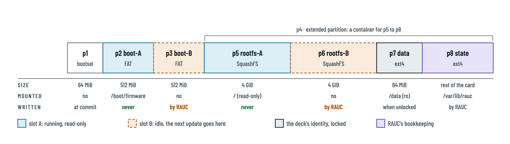

```text
MBR, fixed disk signature 0x5d0bc1ec (<id> = 5d0bc1ec)
| p1 bootsel | p2 boot-A | p3 boot-B | p4 extended ───────────────────────────────────────────── |
| FAT32      | FAT32     | FAT32     | p5 rootfs-A  | p6 rootfs-B  | p7 data     | p8 state       |
| 64 MiB     | 512 MiB   | 512 MiB   | SquashFS 4G  | SquashFS 4G  | ext4 64 MiB | ext4, the rest |
```

| # | Holds | Mounted (slot A running) | Written |
|---|---|---|---|
| p1 bootsel | `autoboot.txt` | no | only at commit, by the backend |
| p2 boot-A | firmware, kernel, initramfs, DTBs, overlays, `config.txt`, `cmdline-a.txt`, `cmdline-b.txt` | `/boot/firmware`, read-only | **never** while A runs |
| p3 boot-B | the same files | no | by RAUC (idle slot) |
| p5 rootfs-A | the system, SquashFS | `/`, under the RAM layer | **never** while A runs |
| p6 rootfs-B | the next system | no | by RAUC (idle slot) |
| p7 data | deck name, Wi-Fi keyfiles, ssh host keys | `/data`, read-only | only when unlocked by hand |
| p8 state | RAUC's data directory, bundles | `/var/lib/rauc`, read-write | by RAUC |

- The image ends at about 13 GiB, so it fits any card of 16 GB or more; the
  rest of a bigger card stays unused.
- Only the **emulator's** card file must be a power of two; it is rounded up
  as a sparse file.

---

## 2. How a deck starts

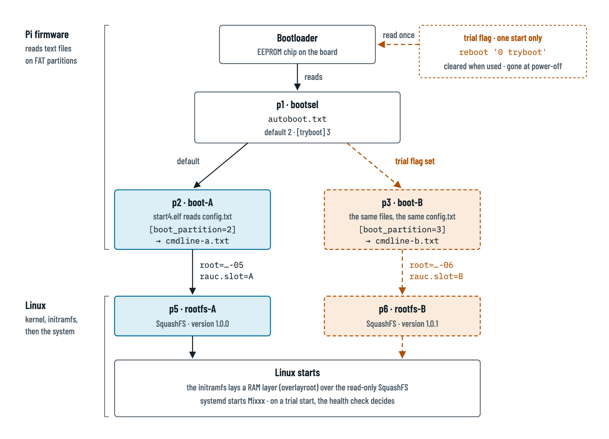

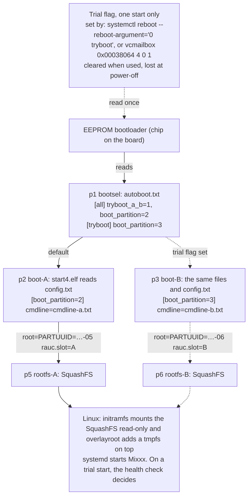

**Facts this rests on.** All are Raspberry Pi's documented mechanism; see
`rauc-pi-4-setup.md` App. A.
- `autoboot.txt` on the first FAT partition picks the boot partition. Its
  `[tryboot]` section applies when the flag is set. `tryboot_a_b=1` makes the
  trial partition read its normal `config.txt`.
- `[boot_partition=N]` in `config.txt` picks a different `cmdline` per boot
  partition, so **both boot partitions hold identical files**.
- The OS reads what the firmware did under `/proc/device-tree/chosen/bootloader/`.
  The values are 32-bit big-endian: `tryboot` (1 on a trial), `partition`
  (the boot partition used), and more. Phase 1 records the exact names on a
  real Pi.

`cmdline-a.txt` (B: `-06`, `rauc.slot=B`, `-03`):

```text
console=tty1 root=PARTUUID=<id>-05 rootfstype=squashfs rootwait=20 panic=10 overlayroot=tmpfs:recurse=0 rauc.slot=A systemd.mount-extra=PARTUUID=<id>-02:/boot/firmware:vfat:ro <the deck's current flags>
```

Never put `resize`, or an `init=` first-boot hook, on these lines. Pi OS's
first boot rewrites the disk ID, which would break `PARTUUID=`.

---

## 3. The running system

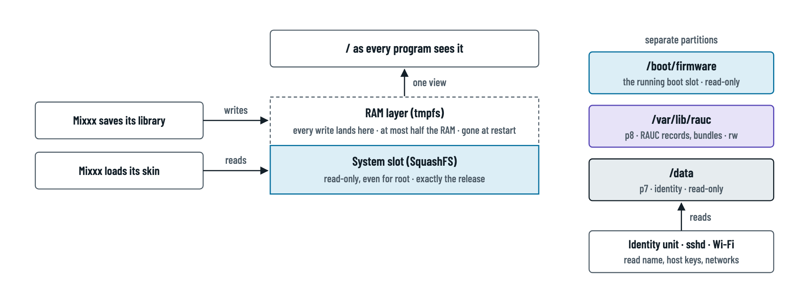

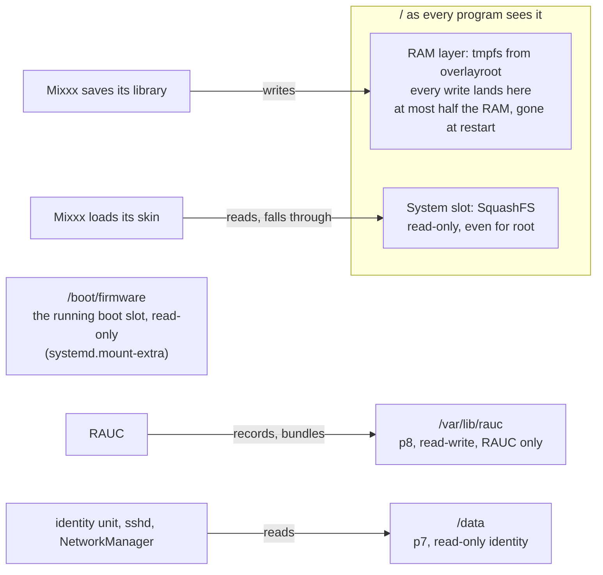

- **overlayroot** is Debian's package (`overlayroot=tmpfs` on the kernel line),
  the same one `raspi-config` uses. The initramfs needs `squashfs` and
  `overlay` listed in `/etc/initramfs-tools/modules`.
- **The RAM layer is bounded.** The kernel caps a size-less tmpfs at half the
  RAM; beyond that writes fail, nothing crashes.
- **Writers are capped:**
  - Mixxx logs: `/tmp/mixxx`, 2 × 32 MiB;
  - journald: volatile, 10 % of `/run`;
  - core dumps: off, via a `coredump.conf` drop-in, `Storage=none`.

  Mixxx's library growth over a set is measured in phase 3.
- **Identity:** the identity unit reads `/data` early and writes only into
  RAM, so NetworkManager and sshd aren't reconfigured, and the dev card (no
  `/data`) is unaffected.
  - Wi-Fi: `/data/NetworkManager/*.nmconnection`, copied to
    `/run/NetworkManager/system-connections/`.
  - ssh host keys: `/data/ssh/ssh_host_*`, copied to `/etc/ssh/`.
  - Deck name: `/data/trimixxx.conf`. The unit sets the hostname and links the
    deck's pre-rendered Mixxx files.
- **machine-id** is regenerated at each start, systemd's standard behaviour on
  a read-only root. NetworkManager uses `dhcp-client-id=mac` so leases stay
  stable.

---

## 4. One update, as states

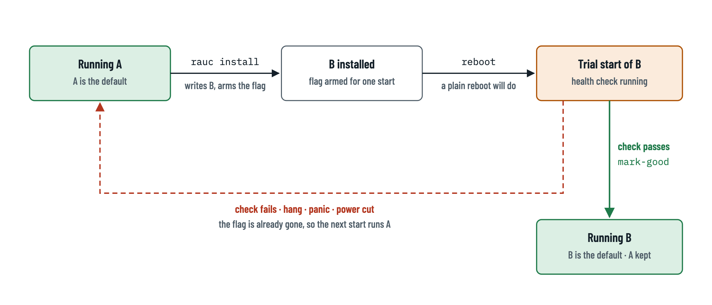

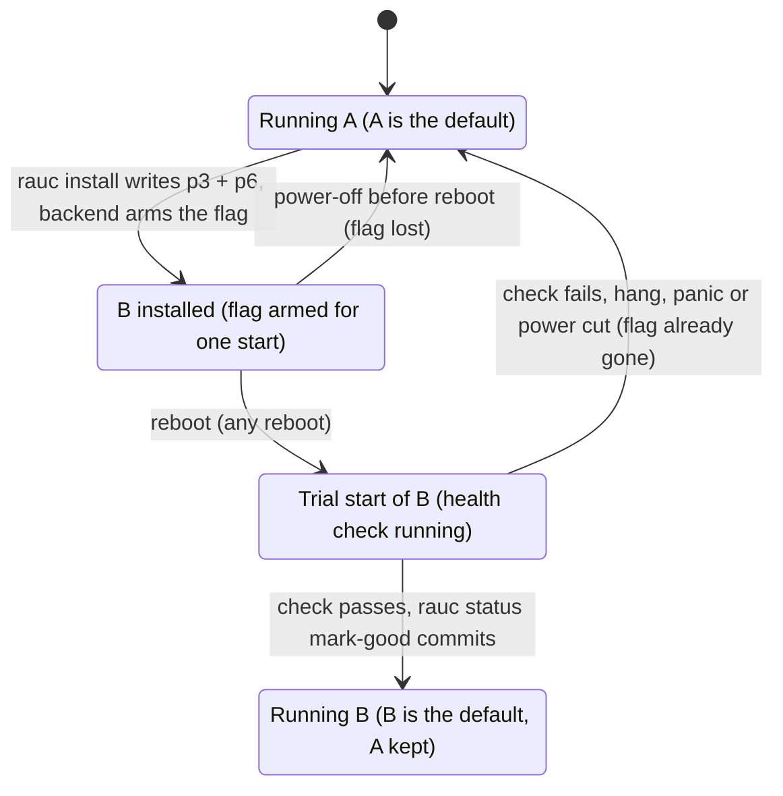

**Rollback** is `rauc status mark-active other`, then a reboot: a trial of
the other slot, like any update.

---

## 5. Who does what during an update

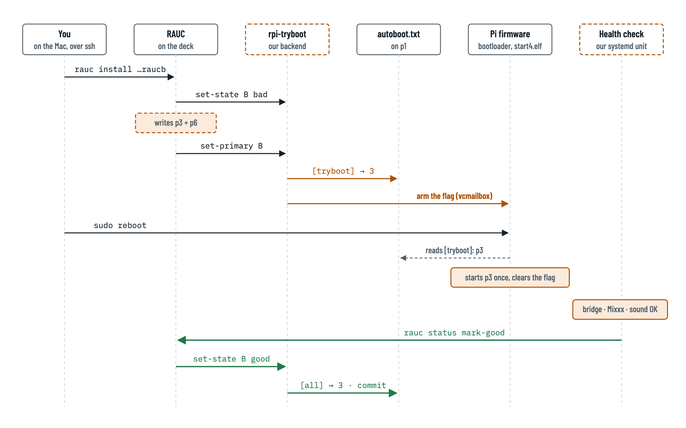

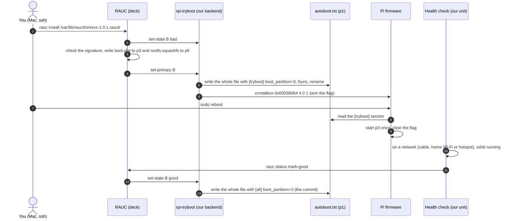

**The backend contract.** RAUC 1.13 calls the backend as follows;
`rauc-pi-4-setup.md` App. B.5 has the full table.

| RAUC calls | When | Backend behaviour |
|---|---|---|
| `get-primary` | `rauc status` | print the bootname of `[all] boot_partition` (2 → A, 3 → B), from the backend's copy in `/var/lib/rauc` if p1's file is damaged |
| `set-state X bad` | start of an install; `mark-bad` | nothing to undo: `[all]` still names the old slot. Exit 0 |
| `set-primary X` | end of an install; `mark-active` | write `autoboot.txt` with `[tryboot] boot_partition=` X's boot partition, then arm the flag |
| `set-state X good` | `mark-good` | if X is running on trial (device tree `tryboot` = 1, `partition` = X's), commit: write the copy in `/var/lib/rauc`, then `autoboot.txt`. Otherwise do nothing |
| `get-state X` | `rauc status` | `good` for the running slot, `bad` for the other |
| `get-current` | never in 1.13, because `rauc.slot=` wins | bootname from `/chosen/bootloader/partition` |

---

## 6. The emulated deck and the real one

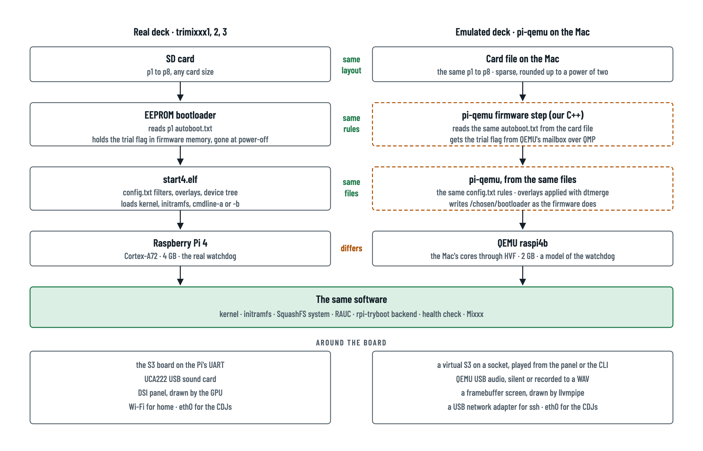

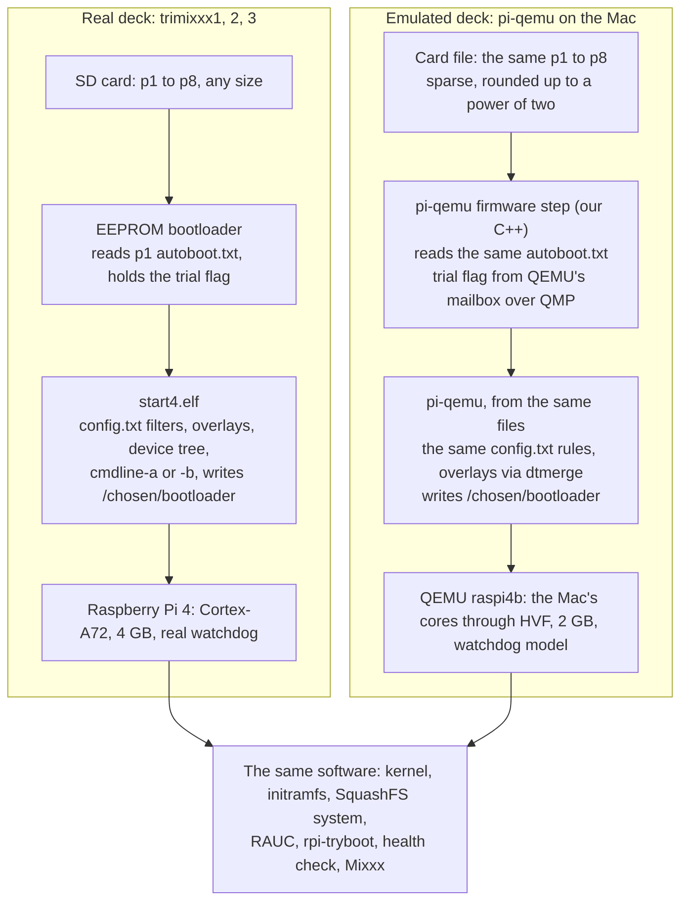

| | Real deck | Emulated deck | |
|---|---|---|---|
| Card | SD card, any size | a sparse file, a power of two | same layout |
| Who chooses the slot | EEPROM bootloader | pi-qemu's firmware step | same rules |
| Trial flag | firmware memory, lost at power-off | QEMU mailbox (patched), read by pi-qemu at reboot | same behaviour |
| Kernel, initramfs, system, RAUC, backend, health check | the same files | the same files | identical |
| CPU and RAM | Cortex-A72, 4 GB | Mac cores, 2 GB | differs |
| Screen | DSI panel, GPU | framebuffer, llvmpipe | differs |
| Network | Wi-Fi at home; eth0 for CDJs | USB NIC for ssh; eth0 | differs |
| Pulling the plug | real power loss | `pi-qemu deck power NAME off` | differs |

**Only real hardware (trimixxx3) can show** what the real `start4.elf` and
EEPROM do: `[boot_partition=N]` on a Pi 4, a broken `autoboot.txt`, the
watchdog's timing, and an SD card losing power. **Phase 1 measures these
first; pi-qemu then copies what was measured.**

---

## 7. How you work with it

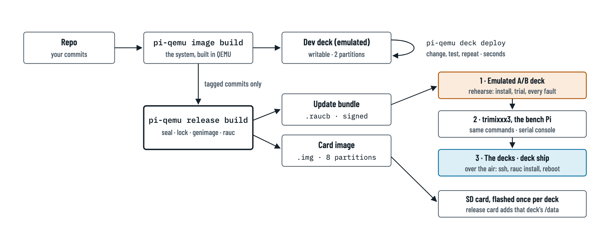

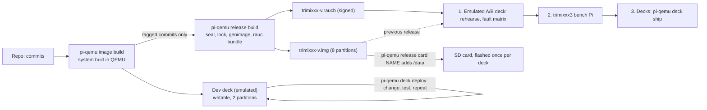

```sh
# day to day (unchanged)
pi-qemu deck up dev
pi-qemu deck deploy dev mixxx                 # or config, system, launcher...

# a release
git tag -m "TriMixxx 1.0.1" pi/v1.0.1
pi-qemu release build                         # the tag's version: out/1.0.1/: trimixxx-1.0.1.img + .raucb + manifest

# rehearse on the emulated A/B deck (started from the previous release's card)
pi-qemu release card trimixxx0 --version 1.0.0   # the emulated deck's card of 1.0.0
pi-qemu deck up ab --from out/1.0.0/trimixxx0-1.0.0.img
pi-qemu deck ship ab --version 1.0.1
pi-qemu deck ssh ab rauc status

# ship to a deck, roll back
pi-qemu deck ship --host trimixxx3 --version 1.0.1   # the bundle over ssh, rauc install, reboot, rauc status
ssh trimixxx3 sudo rauc status mark-active other && ssh trimixxx3 sudo reboot

# a new deck: one physical flash
pi-qemu release card trimixxx4                # the release card with that deck's /data
```

---

## 8. When something goes wrong

Every row is rehearsed on the emulated deck first, then on trimixxx3. All of
them passed on the emulated deck, and on trimixxx3 where only hardware can
tell, power cuts and the watchdog included, on 2026-10-08 (`PLAN.md` §5.4,
§6).

| Fault | What catches it | Ends on |
|---|---|---|
| Damaged bundle, or one you didn't sign | RAUC's signature check, before writing | A |
| Power lost during install | only the idle slot was being written | A |
| Power lost after install, before the reboot | the flag doesn't survive power-off | A (install again) |
| New system doesn't boot | `panic=10`, in the kernel and in the initramfs; the flag is gone | A |
| New system freezes | hardware watchdog armed from the firmware (`kernel_watchdog_timeout`): about 60 s into the hang | A |
| It boots, but can't take the next release: no network, or no sshd | health check: `mark-bad`, then a reboot | A |
| It can take the next release, but Mixxx, the sound or the S3 fails | nothing, on purpose: the next release fixes it over the air | the new slot |
| Power lost during the commit | a copy written first on the state partition, then `autoboot.txt` whole and synced. A broken `autoboot.txt` starts p2 (measured); the start-up `repair` restores the copy, and reboots into B if B was committed | the committed slot |
| A committed slot breaks later | tryboot's one weak spot. Measured: `kernel_watchdog_partition` doesn't switch slots, so a hang in Linux loops. The decks set the EEPROM's boot watchdog: a failure before Linux then starts A after 45 s, and the backend commits A if it passes the health check. Otherwise, on a Mac, change the slot `autoboot.txt` commits (the volume `BOOTSEL`): the deck keeps that edit | A when B was committed; otherwise a hand on a Mac |

---

## 9. Standard parts and our own

| Job | Part | Kind | Why we write any of it |
|---|---|---|---|
| Choose the slot, trial, fall back | Pi firmware `autoboot.txt` + tryboot | standard | — |
| Command line per slot | `config.txt` `[boot_partition=N]` | standard | Saves an install hook |
| Check, install and record updates | RAUC 1.13 (Debian) | standard | — |
| Read-only system, RAM layer | SquashFS + `overlayroot` | standard | — |
| Restarts on hangs and panics | firmware/systemd watchdogs, `panic=` | settings | — |
| Wi-Fi, ssh keys, `/data` lock | standard NetworkManager keyfiles and OpenSSH host keys, an fstab `ro` mount | formats and settings | — |
| Build the card and bundle | genimage, mksquashfs, `rauc bundle` in Docker | config files | `genimage.cfg`, Dockerfile, manifest, Make targets |
| Connect RAUC to the Pi firmware | `rpi-tryboot` (~100 lines) | **ours** | RAUC 1.13 has no Pi firmware backend. Delete it when RAUC's own (PR #1599, aimed at 1.17) ships |
| Decide the deck is healthy | systemd unit calling `rauc status mark-good` | **ours** (the checks) | What "healthy" means is deck-specific |
| Who this deck is | identity unit | **ours** | Per-device app config has no standard tool |
| A/B in the emulator | pi-qemu firmware step + one QEMU patch | **ours** | QEMU runs no Pi firmware |

**Why tryboot and not U-Boot.** U-Boot would leave the firmware, device tree
and `config.txt` outside A/B. It would write the card at every boot, has no
Pi watchdog support, and adds boot time. Full comparison:
`rauc-pi-4-setup.md` App. C.2.

---

## 10. Phases

The detail (tasks, commands, tests, stop points) is in `PLAN.md`.

| # | Phase | Done when |
|---|---|---|
| 1 | Firmware facts on trimixxx3 | every unverified firmware point has a measured answer |
| 2 | Tryboot in pi-qemu | the phase 1 card behaves the same in pi-qemu as on trimixxx3 |
| 3 | A locked card | a tag gives a card that boots locked in QEMU, its splash showing the slot (`A`/`B`, `trial`) and the version; the RAM layer is measured over a set |
| 4 | RAUC on the deck | the whole fault table passes in QEMU |
| 5 | trimixxx3 end to end | the fault table passes on hardware |
| 6 | The decks (only with Sam) | every deck has taken a release over the air |
